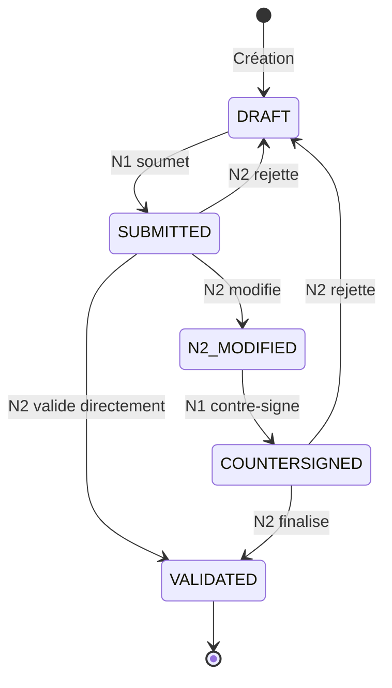
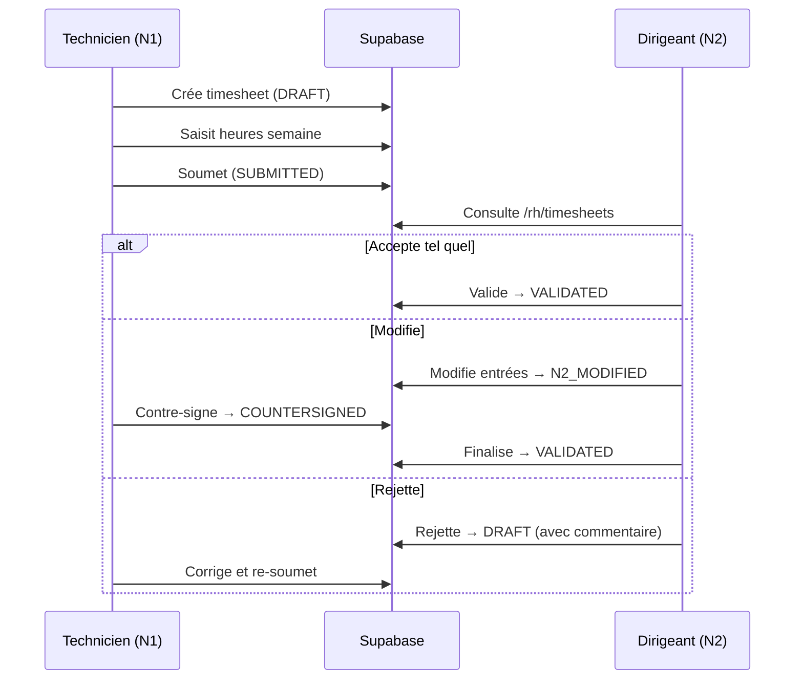
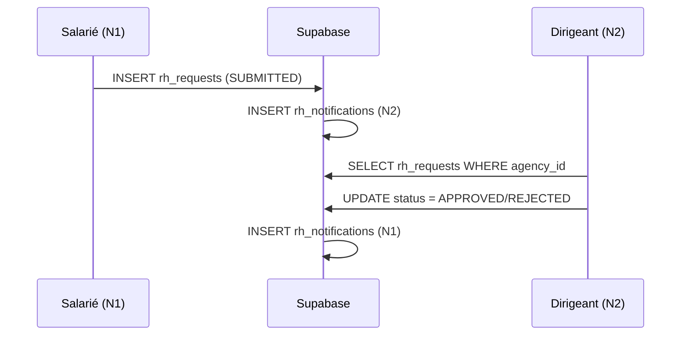

# 📋 AUDIT COMPLET MODULE RH

**Date:** 2025-12-18  
**Version:** 2.0  
**Statut:** ✅ OPÉRATIONNEL

---

## 📑 TABLE DES MATIÈRES

1. [Vue d'ensemble](#1-vue-densemble)
2. [Architecture technique](#2-architecture-technique)
3. [Routes et navigation](#3-routes-et-navigation)
4. [Tables de données](#4-tables-de-données)
5. [Hooks et logique métier](#5-hooks-et-logique-métier)
6. [Module Pointages/Timesheets](#6-module-pointages-timesheets)
7. [Flux métier](#7-flux-métier)
8. [Ce qui est prêt](#8-ce-qui-est-prêt)
9. [Recommandations](#9-recommandations)

---

## 1. VUE D'ENSEMBLE

### 🎯 Objectif du module
Le module RH gère toutes les fonctionnalités liées aux ressources humaines de l'agence :
- **Côté N1 (Salarié)** : Coffre-fort documents, demandes, planning personnel, signature, pointages
- **Côté N2 (Dirigeant/RH)** : Gestion équipe, traitement demandes, validation pointages, dashboard RH

### 📊 État actuel
| Fonctionnalité | Statut |
|----------------|--------|
| Coffre-fort documents N1 | ✅ Opérationnel |
| Demandes RH unifiées | ✅ Opérationnel |
| Planning personnel N1 | ✅ Opérationnel |
| Signature électronique | ✅ Opérationnel |
| Pointages/Timesheets | ✅ Opérationnel |
| Validation N2 | ✅ Opérationnel |
| Dashboard RH N2 | ✅ Opérationnel |

---

## 2. ARCHITECTURE TECHNIQUE

### 📁 Structure des fichiers

```
src/
├── pages/
│   ├── RHIndex.tsx                    # ✅ Hub RH principal
│   ├── EquipePage.tsx                 # ✅ Collaborateurs agence
│   ├── CollaborateursPage.tsx         # ✅ Liste collaborateurs
│   ├── CollaborateurProfilePage.tsx   # ✅ Profil collaborateur
│   ├── RHDashboardPage.tsx            # ✅ Dashboard RH
│   ├── rh/
│   │   ├── DemandesRHUnifiedPage.tsx  # ✅ Page unifiée demandes (N2)
│   │   ├── RHSuiviIndex.tsx           # ✅ Suivi RH back-office
│   │   ├── RHCollaborateurPage.tsx    # ✅ Détail collaborateur
│   │   └── TimesheetsValidationPage.tsx # ✅ Validation pointages (N2)
│   └── rh-employee/
│       ├── MesCoffreRHPage.tsx        # ✅ Coffre RH salarié
│       ├── MesDemandesPage.tsx        # ✅ Demandes salarié
│       ├── MonPlanningPage.tsx        # ✅ Planning personnel
│       └── MaSignaturePage.tsx        # ✅ Signature électronique
├── hooks/
│   ├── rh/
│   │   ├── useRHNotifications.ts      # ✅ Notifications RH
│   │   ├── useRHAuditLog.ts           # ✅ Audit RH
│   │   ├── useAgencyTimesheets.ts     # ✅ Pointages agence (N2)
│   │   └── useDocumentRequestLock.ts  # ✅ Verrouillage demandes
│   └── rh-employee/
│       ├── useMyCollaborator.ts       # ✅ Collaborateur courant
│       ├── useMyDocuments.ts          # ✅ Documents personnels
│       ├── useMyRequests.ts           # ✅ Mes demandes
│       ├── useMySignature.ts          # ✅ Signature perso
│       └── useTimesheets.ts           # ✅ Mes pointages (N1)
└── components/
    └── rh/
        ├── RHNotificationBadge.tsx    # ✅ Badge notifications
        ├── RHLoginNotificationPopup.tsx # ✅ Popup notifications
        └── GenerateDocumentDialog.tsx # ✅ Génération documents
```

---

## 3. ROUTES ET NAVIGATION

### 📍 Routes déclarées

```typescript
rh: {
  index: '/rh',                           // ✅ RHIndex
  suivi: '/rh/suivi',                     // ✅ RHSuiviIndex (N2)
  suiviCollaborateur: '/rh/suivi/:id',    // ✅ RHCollaborateurPage
  coffre: '/rh/coffre',                   // ✅ MesCoffreRHPage (N1)
  demande: '/rh/demande',                 // ✅ MesDemandesPage (N1)
  monPlanning: '/rh/mon-planning',        // ✅ MonPlanningPage (N1)
  signature: '/rh/signature',             // ✅ MaSignaturePage (N1)
  equipe: '/rh/equipe',                   // ✅ CollaborateursPage (N2)
  plannings: '/rh/equipe/plannings',      // ✅ PlanningHebdo (N2)
  collaborateurProfile: '/rh/equipe/:id', // ✅ CollaborateurProfilePage
  demandes: '/rh/demandes',               // ✅ DemandesRHUnifiedPage (N2)
  timesheets: '/rh/timesheets',           // ✅ TimesheetsValidationPage (N2)
  conges: '/rh/conges',                   // 🔀 REDIRECT → /rh/demandes
  dashboard: '/rh/dashboard',             // ✅ RHDashboardPage (N2)
}
```

### 📍 Routes avec Guards

| Route | Page | Guard | Statut |
|-------|------|-------|--------|
| `/rh` | RHIndex | RoleGuard N1+ | ✅ |
| `/rh/suivi` | RHSuiviIndex | RoleGuard N2+ | ✅ |
| `/rh/suivi/:id` | RHCollaborateurPage | RoleGuard N2+ | ✅ |
| `/rh/coffre` | MesCoffreRHPage | RoleGuard N1+ | ✅ |
| `/rh/demande` | MesDemandesPage | RoleGuard N1+ | ✅ |
| `/rh/mon-planning` | MonPlanningPage | RoleGuard N1+ | ✅ |
| `/rh/signature` | MaSignaturePage | RoleGuard N1+ | ✅ |
| `/rh/equipe` | CollaborateursPage | RoleGuard N2+ | ✅ |
| `/rh/timesheets` | TimesheetsValidationPage | RoleGuard N2+ | ✅ |
| `/rh/demandes` | DemandesRHUnifiedPage | RoleGuard N2+ | ✅ |
| `/rh/dashboard` | RHDashboardPage | RoleGuard N2+ | ✅ |

---

## 4. TABLES DE DONNÉES

### 🗃️ Tables principales

#### `rh_requests` (Demandes unifiées)
| Colonne | Type | Description |
|---------|------|-------------|
| id | uuid | PK |
| request_type | text | LEAVE / EPI_RENEWAL / DOCUMENT / OTHER |
| employee_user_id | uuid | FK → profiles.id |
| agency_id | uuid | FK → apogee_agencies.id |
| status | text | DRAFT / SUBMITTED / APPROVED / REJECTED / CANCELLED |
| payload | jsonb | Données spécifiques au type |

#### `timesheets` (Pointages)
| Colonne | Type | Description |
|---------|------|-------------|
| id | uuid | PK |
| user_id | uuid | FK → profiles.id (technicien) |
| agency_id | uuid | FK → apogee_agencies.id |
| week_start | date | Lundi de la semaine |
| status | text | DRAFT / SUBMITTED / N2_MODIFIED / COUNTERSIGNED / VALIDATED |
| entries_original | jsonb | Entrées originales N1 |
| entries_modified | jsonb | Entrées modifiées N2 (null si non modifié) |
| submitted_at | timestamp | Date soumission N1 |
| modified_at | timestamp | Date modification N2 |
| validated_at | timestamp | Date validation finale |
| validated_by | uuid | N2 qui a validé |
| rejection_comment | text | Commentaire si rejet |

#### `rh_notifications`
| Colonne | Type | Description |
|---------|------|-------------|
| id | uuid | PK |
| recipient_id | uuid | Destinataire notification |
| notification_type | text | REQUEST_CREATED/REQUEST_COMPLETED/etc |
| is_read | boolean | Lu |

---

## 5. HOOKS ET LOGIQUE MÉTIER

### ✅ Hooks fonctionnels

| Hook | Table | Rôle |
|------|-------|------|
| `useMyRequests` | rh_requests | N1 - Mes demandes |
| `useAgencyRequests` | rh_requests | N2 - Demandes agence |
| `useTimesheets` | timesheets | N1 - Mes pointages |
| `useAgencyTimesheets` | timesheets | N2 - Pointages agence |
| `useRHNotifications` | rh_notifications | Notifications temps réel |
| `useMyCollaborator` | collaborators | Profil collaborateur |
| `useMyDocuments` | collaborator_documents | Documents personnels |
| `useMySignature` | user_signatures | Signature électronique |

---

## 6. MODULE POINTAGES/TIMESHEETS

### 📋 Workflow 5 états



### 🔐 Règles de transition

| État actuel | Action | Nouvel état | Acteur |
|-------------|--------|-------------|--------|
| DRAFT | Soumettre | SUBMITTED | N1 |
| SUBMITTED | Valider | VALIDATED | N2 |
| SUBMITTED | Modifier | N2_MODIFIED | N2 |
| SUBMITTED | Rejeter | DRAFT | N2 |
| N2_MODIFIED | Contre-signer | COUNTERSIGNED | N1 |
| COUNTERSIGNED | Finaliser | VALIDATED | N2 |
| COUNTERSIGNED | Rejeter | DRAFT | N2 |

### 📁 Fichiers clés

| Fichier | Rôle |
|---------|------|
| `src/pages/rh/TimesheetsValidationPage.tsx` | Page validation N2 |
| `src/hooks/rh/useAgencyTimesheets.ts` | Hook pointages agence |
| `src/hooks/rh-employee/useTimesheets.ts` | Hook pointages N1 |

### 📊 Structure des entrées

```typescript
interface TimesheetEntry {
  day: string;      // 'monday' | 'tuesday' | ...
  start_am: string; // '08:00'
  end_am: string;   // '12:00'
  start_pm: string; // '14:00'
  end_pm: string;   // '18:00'
  total_minutes: number;
}

interface Timesheet {
  id: string;
  user_id: string;
  agency_id: string;
  week_start: string;
  status: 'DRAFT' | 'SUBMITTED' | 'N2_MODIFIED' | 'COUNTERSIGNED' | 'VALIDATED';
  entries_original: TimesheetEntry[];
  entries_modified: TimesheetEntry[] | null;
}
```

---

## 7. FLUX MÉTIER

### 📊 Flux Pointage N1 → N2



### 📊 Flux Demande RH



---

## 8. CE QUI EST PRÊT

### ✅ FONCTIONNALITÉS OPÉRATIONNELLES

| Fonctionnalité | Page | Table | Status |
|----------------|------|-------|--------|
| Coffre-fort documents N1 | /rh/coffre | collaborator_documents | ✅ |
| Signature électronique N1 | /rh/signature | user_signatures | ✅ |
| Planning personnel N1 | /rh/mon-planning | planning_signatures | ✅ |
| Demandes RH N1 | /rh/demande | rh_requests | ✅ |
| Traitement demandes N2 | /rh/demandes | rh_requests | ✅ |
| Liste collaborateurs N2 | /rh/equipe | collaborators | ✅ |
| Profil collaborateur N2 | /rh/equipe/:id | collaborators | ✅ |
| Suivi RH N2 | /rh/suivi | collaborators + rh_* | ✅ |
| Dashboard RH N2 | /rh/dashboard | - | ✅ |
| **Pointages N1** | /t/pointage | timesheets | ✅ |
| **Validation pointages N2** | /rh/timesheets | timesheets | ✅ |

---

## 9. RECOMMANDATIONS

### 🔧 Améliorations futures (P2)

1. **Export pointages** : Export CSV/Excel des pointages validés
2. **Statistiques pointages** : Dashboard heures travaillées par technicien
3. **Alertes automatiques** : Notification si pointage non soumis en fin de semaine
4. **Historique modifications** : Log détaillé des changements N2

### 📋 Checklist maintenance

- [x] Workflow 5 états implémenté
- [x] RLS policies sur timesheets
- [x] Séparation stricte N1/N2
- [x] Affichage modifications en rouge
- [x] Conservation entrées originales vs modifiées
- [ ] Tests E2E workflow complet
- [ ] Export données pointages

---

## 📞 SUPPORT

Pour toute question sur ce module, contacter l'équipe développement.

**Dernière mise à jour:** 2025-12-18
