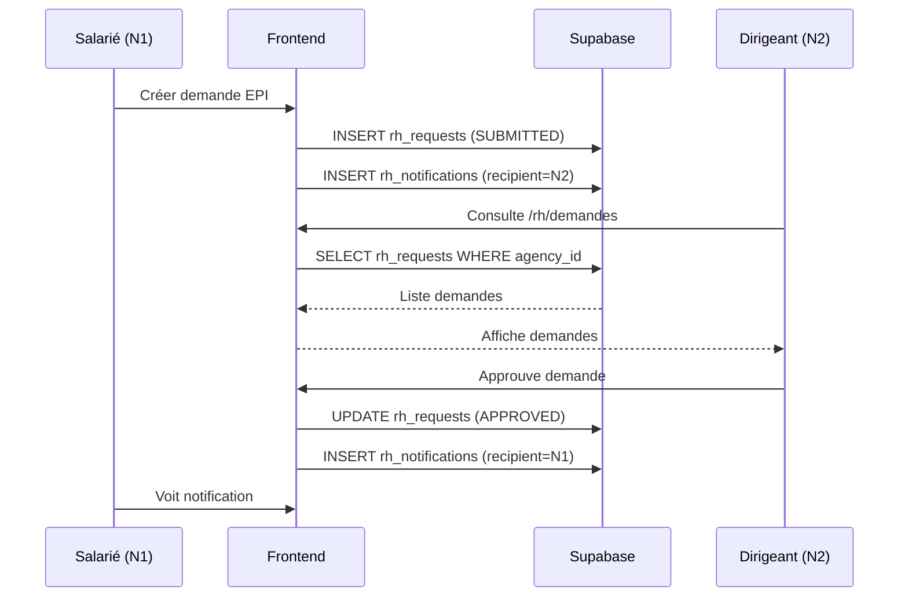
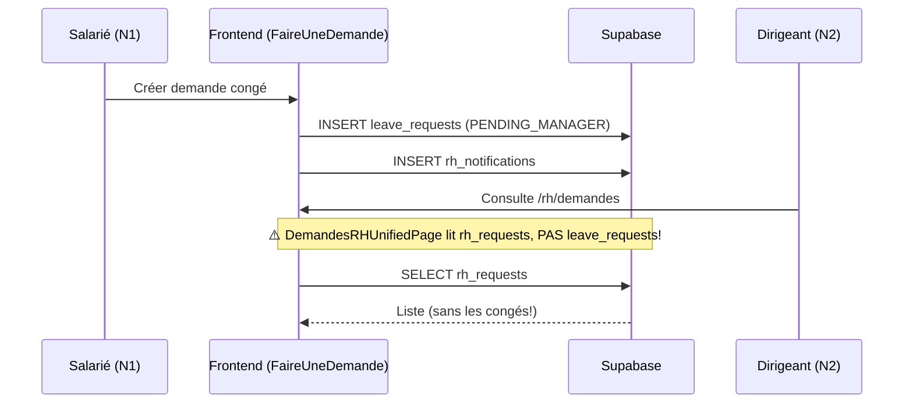

# 📋 AUDIT COMPLET MODULE RH

**Date:** 2025-12-14  
**Version:** 1.0  
**Statut:** ⚠️ PARTIELLEMENT OPÉRATIONNEL

---

## 📑 TABLE DES MATIÈRES

1. [Vue d'ensemble](#1-vue-densemble)
2. [Architecture technique](#2-architecture-technique)
3. [Routes et navigation](#3-routes-et-navigation)
4. [Tables de données](#4-tables-de-données)
5. [Hooks et logique métier](#5-hooks-et-logique-métier)
6. [Problèmes identifiés (P0/P1/P2)](#6-problèmes-identifiés)
7. [Flux métier](#7-flux-métier)
8. [Ce qui est prêt vs En attente](#8-ce-qui-est-prêt-vs-en-attente)
9. [Recommandations](#9-recommandations)

---

## 1. VUE D'ENSEMBLE

### 🎯 Objectif du module
Le module RH gère toutes les fonctionnalités liées aux ressources humaines de l'agence :
- **Côté N1 (Salarié)** : Coffre-fort documents, demandes, planning personnel, signature
- **Côté N2 (Dirigeant/RH)** : Gestion équipe, traitement demandes, dashboard RH

### 📊 État actuel des données
| Table | Nombre d'enregistrements |
|-------|-------------------------|
| collaborators | 15 |
| collaborator_documents | 143 |
| rh_requests | 5 |
| leave_requests | 0 ⚠️ |
| rh_notifications | 0 ⚠️ |
| rh_letter_templates | 1 |

---

## 2. ARCHITECTURE TECHNIQUE

### 📁 Structure des fichiers

```
src/
├── pages/
│   ├── RHIndex.tsx                    # ✅ Hub RH principal
│   ├── GestionConges.tsx              # ⚠️ Page legacy congés (leave_requests)
│   ├── FaireUneDemande.tsx            # ⚠️ Page legacy demande congés (leave_requests)
│   ├── MonCoffreRH.tsx                # ❌ LEGACY - redirection vers /rh/coffre
│   ├── EquipePage.tsx                 # ✅ Collaborateurs agence
│   ├── CollaborateursPage.tsx         # ✅ Liste collaborateurs
│   ├── CollaborateurProfilePage.tsx   # ✅ Profil collaborateur
│   ├── RHDashboardPage.tsx            # ✅ Dashboard RH
│   ├── DemandesRHPage.tsx             # ❓ LEGACY - à vérifier
│   ├── rh/
│   │   ├── DemandesRHUnifiedPage.tsx  # ✅ Page unifiée demandes (rh_requests)
│   │   ├── RHSuiviIndex.tsx           # ✅ Suivi RH back-office
│   │   └── RHCollaborateurPage.tsx    # ✅ Détail collaborateur
│   └── rh-employee/
│       ├── MesCoffreRHPage.tsx        # ✅ Coffre RH salarié
│       ├── MesDemandesPage.tsx        # ✅ Demandes salarié (rh_requests)
│       ├── MonPlanningPage.tsx        # ✅ Planning personnel
│       └── MaSignaturePage.tsx        # ✅ Signature électronique
├── hooks/
│   ├── rh/
│   │   ├── useRHNotifications.ts      # ✅ Notifications RH
│   │   ├── useRHAuditLog.ts           # ✅ Audit RH
│   │   └── useDocumentRequestLock.ts  # ✅ Verrouillage demandes
│   ├── rh-employee/
│   │   ├── useMyCollaborator.ts       # ✅ Collaborateur courant
│   │   ├── useMyDocuments.ts          # ✅ Documents personnels
│   │   ├── useMyRequests.ts           # ✅ Mes demandes (rh_requests)
│   │   └── useMySignature.ts          # ✅ Signature perso
│   ├── rh-backoffice/
│   │   └── useAgencyRequests.ts       # ✅ Demandes agence (rh_requests)
│   ├── useLeaveRequests.ts            # ⚠️ LEAVE_REQUESTS (table séparée!)
│   └── useLeaveDecision.ts            # ⚠️ LEAVE_REQUESTS (table séparée!)
└── components/
    └── rh/
        ├── RHNotificationBadge.tsx    # ✅ Badge notifications
        ├── RHLoginNotificationPopup.tsx # ✅ Popup notifications
        └── GenerateDocumentDialog.tsx # ✅ Génération documents
```

---

## 3. ROUTES ET NAVIGATION

### 📍 Routes déclarées dans `routes.ts`

```typescript
rh: {
  index: '/rh',                           // ✅ RHIndex
  suivi: '/rh/suivi',                     // ✅ RHSuiviIndex (N2)
  suiviCollaborateur: '/rh/suivi/:id',    // ✅ RHCollaborateurPage
  coffre: '/rh/coffre',                   // ✅ MesCoffreRHPage (N1)
  demande: '/rh/demande',                 // ✅ MesDemandesPage (N1)
  monPlanning: '/rh/mon-planning',        // ✅ MonPlanningPage (N1)
  signature: '/rh/signature',             // ✅ MaSignaturePage (N1)
  equipe: '/rh/equipe',                   // ✅ CollaborateursPage (N2)
  plannings: '/rh/equipe/plannings',      // ✅ PlanningHebdo (N2)
  collaborateurProfile: '/rh/equipe/:id', // ✅ CollaborateurProfilePage
  demandes: '/rh/demandes',               // ✅ DemandesRHUnifiedPage (N2)
  conges: '/rh/conges',                   // 🔀 REDIRECT → /rh/demandes
  dashboard: '/rh/dashboard',             // ✅ RHDashboardPage (N2)
}
```

### 📍 Routes déclarées dans `App.tsx`

| Route | Page | Guard | Module | Statut |
|-------|------|-------|--------|--------|
| `/rh` | RHIndex | RoleGuard | rh | ✅ |
| `/rh/suivi` | RHSuiviIndex | N2+ | - | ✅ |
| `/rh/suivi/:id` | RHCollaborateurPage | N2+ | - | ✅ |
| `/rh/coffre` | MesCoffreRHPage | N1+ | - | ✅ |
| `/rh/demande` | MesDemandesPage | N1+ | - | ✅ |
| `/rh/mon-planning` | MonPlanningPage | N1+ | - | ✅ |
| `/rh/signature` | MaSignaturePage | N1+ | - | ✅ |
| `/rh/equipe` | CollaborateursPage | N2+ | rh (viewer/admin) | ✅ |
| `/rh/equipe/plannings` | PlanningHebdo | N2+ | rh (viewer/admin) | ✅ |
| `/rh/equipe/:id` | CollaborateurProfilePage | N2+ | rh (viewer/admin) | ✅ |
| `/rh/demandes` | DemandesRHUnifiedPage | N2+ | rh (viewer/admin) | ✅ |
| `/rh/conges` | Navigate → /rh/demandes | - | - | 🔀 Redirect |
| `/rh/dashboard` | RHDashboardPage | N2+ | rh_admin | ✅ |

### 📍 Redirections Legacy

```
/pilotage/mon-coffre-rh → /rh/coffre
/mon-coffre-rh → /rh/coffre
/faire-une-demande → /rh/demande
/hc-agency/equipe → /rh/equipe
/hc-agency/collaborateurs → /rh/equipe
/hc-agency/collaborateurs/:id → /rh/equipe/:id
/hc-agency/demandes-rh → /rh/demandes
/hc-agency/gestion-conges → /rh/demandes
/hc-agency/dashboard-rh → /rh/dashboard
```

---

## 4. TABLES DE DONNÉES

### 🗃️ Tables principales

#### `rh_requests` (Table unifiée des demandes)
| Colonne | Type | Description |
|---------|------|-------------|
| id | uuid | PK |
| request_type | text | LEAVE / EPI_RENEWAL / DOCUMENT / OTHER |
| employee_user_id | uuid | FK → profiles.id |
| agency_id | uuid | FK → apogee_agencies.id |
| status | text | DRAFT / SUBMITTED / APPROVED / REJECTED |
| payload | jsonb | Données spécifiques au type |
| generated_letter_path | text | Chemin fichier généré |
| generated_letter_file_name | text | Nom fichier |
| employee_can_download | boolean | Publication pour salarié |
| reviewed_by | uuid | Validateur |
| reviewed_at | timestamp | Date validation |
| decision_comment | text | Commentaire décision |

#### `leave_requests` (⚠️ Table legacy congés)
| Colonne | Type | Description |
|---------|------|-------------|
| id | uuid | PK |
| collaborator_id | uuid | FK → collaborators.id |
| agency_id | uuid | FK |
| type | text | CP / SANS_SOLDE / EVENT / MALADIE |
| event_subtype | text | MARIAGE / NAISSANCE / DECES |
| start_date / end_date | date | Période |
| days_count | numeric | Jours décomptés |
| status | text | DRAFT/PENDING_MANAGER/PENDING_JUSTIFICATIVE/ACKNOWLEDGED/APPROVED/REFUSED/CLOSED |
| manager_comment | text | Commentaire manager |
| refusal_reason | text | Motif refus |
| justification_document_id | uuid | Justificatif uploadé |

#### `rh_notifications`
| Colonne | Type | Description |
|---------|------|-------------|
| id | uuid | PK |
| collaborator_id | uuid | Collaborateur concerné |
| recipient_id | uuid | Destinataire notification |
| sender_id | uuid | Expéditeur |
| agency_id | uuid | Agence |
| notification_type | text | REQUEST_CREATED/REQUEST_COMPLETED/REQUEST_REJECTED/etc |
| title / message | text | Contenu |
| related_request_id | uuid | Demande liée |
| is_read | boolean | Lu |

---

## 5. HOOKS ET LOGIQUE MÉTIER

### ✅ Hooks fonctionnels

| Hook | Table | Statut |
|------|-------|--------|
| `useMyRequests` | rh_requests | ✅ |
| `useCreateRequest` | rh_requests | ✅ |
| `useCancelRequest` | rh_requests | ✅ |
| `useAgencyRequests` | rh_requests | ✅ |
| `useApproveRequest` | rh_requests | ✅ |
| `useRejectRequest` | rh_requests | ✅ |
| `useRHNotifications` | rh_notifications | ✅ |
| `useMyCollaborator` | collaborators | ✅ |
| `useMyDocuments` | collaborator_documents | ✅ |
| `useMySignature` | user_signatures | ✅ |

### ⚠️ Hooks legacy (LEAVE_REQUESTS)

| Hook | Table | Problème |
|------|-------|----------|
| `useMyLeaveRequests` | leave_requests | Table legacy |
| `useAgencyLeaveRequests` | leave_requests | Table legacy |
| `useCreateLeaveRequest` | leave_requests | Table legacy |
| `useUpdateLeaveRequest` | leave_requests | Table legacy |
| `useProcessLeaveRequest` | leave_requests | Table legacy |

---

## 6. PROBLÈMES IDENTIFIÉS

### 🔴 P0 - CRITIQUE

#### P0-1: DOUBLE SYSTÈME DE DEMANDES
```
PROBLÈME: Deux tables coexistent pour les demandes
- rh_requests (nouvelle, unifiée)
- leave_requests (legacy, congés spécifiques)

IMPACT:
- Les demandes de congés via FaireUneDemande.tsx → leave_requests
- Les demandes via MesDemandesPage.tsx → rh_requests (type LEAVE)
- Le N2 voit /rh/demandes (rh_requests) mais pas les vraies demandes congés

SOLUTION:
Option A: Migrer tout vers rh_requests (recommandé)
Option B: Afficher les deux dans DemandesRHUnifiedPage
```

#### P0-2: NOTIFICATIONS NON FONCTIONNELLES
```
PROBLÈME: 0 notifications en base malgré les demandes

CAUSE IDENTIFIÉE:
1. useLeaveRequests.ts crée des notifs dans rh_notifications
2. useLeaveDecision.ts aussi
3. MAIS: Les RLS policies bloquaient les INSERT

SOLUTION APPLIQUÉE:
- Migration RLS appliquée (any_user_can_create_notifications)
- À TESTER après confirmation migration
```

### 🟡 P1 - IMPORTANT

#### P1-1: Page FaireUneDemande.tsx orpheline
```
PROBLÈME: La page /faire-une-demande redirige vers /rh/demande
MAIS: FaireUneDemande.tsx existe encore et utilise leave_requests

IMPACT: Confusion, code mort potentiel

SOLUTION: Supprimer FaireUneDemande.tsx ou l'intégrer dans MesDemandesPage
```

#### P1-2: Page GestionConges.tsx utilisée mais /rh/conges redirige
```
PROBLÈME: 
- /rh/conges → Navigate to /rh/demandes
- MAIS GestionConges.tsx existe et est importé dans App.tsx

ANALYSE App.tsx: GestionConges est importé mais non utilisé dans les routes!
C'est du code mort.

SOLUTION: Supprimer GestionConges.tsx (code mort)
```

#### P1-3: MonCoffreRH.tsx vs MesCoffreRHPage.tsx
```
PROBLÈME: Deux fichiers similaires
- src/pages/MonCoffreRH.tsx (legacy)
- src/pages/rh-employee/MesCoffreRHPage.tsx (nouveau)

ANALYSE: MonCoffreRH.tsx est utilisé par /mon-coffre-rh (legacy redirect)
MesCoffreRHPage.tsx est utilisé par /rh/coffre

SOLUTION: MonCoffreRH.tsx peut être supprimé (redirect en place)
```

### 🟢 P2 - AMÉLIORATION

#### P2-1: Unification UX congés
```
SUGGESTION: Le wizard de congés (LeaveRequestWizard) devrait créer 
dans rh_requests avec type=LEAVE, pas dans leave_requests
```

#### P2-2: Toast/Popup notifications
```
SUGGESTION: Ajouter un toast Sonner quand nouvelle notification reçue
(pas seulement badge cloche)
```

---

## 7. FLUX MÉTIER

### 📊 Flux N1 → N2 (Demande EPI via rh_requests)



### 📊 Flux N1 → N2 (Demande congés via leave_requests - LEGACY)



**PROBLÈME CRITIQUE:** Le N2 ne voit PAS les demandes de congés car elles sont dans `leave_requests`, pas `rh_requests`.

---

## 8. CE QUI EST PRÊT VS EN ATTENTE

### ✅ PRÊT À L'EMPLOI

| Fonctionnalité | Page | Table | Status |
|----------------|------|-------|--------|
| Coffre-fort documents N1 | /rh/coffre | collaborator_documents | ✅ |
| Signature électronique N1 | /rh/signature | user_signatures | ✅ |
| Planning personnel N1 | /rh/mon-planning | planning_signatures | ✅ |
| Demandes EPI N1 | /rh/demande | rh_requests | ✅ |
| Demandes autres N1 | /rh/demande | rh_requests | ✅ |
| Traitement demandes N2 | /rh/demandes | rh_requests | ✅ |
| Liste collaborateurs N2 | /rh/equipe | collaborators | ✅ |
| Profil collaborateur N2 | /rh/equipe/:id | collaborators | ✅ |
| Plannings équipe N2 | /rh/equipe/plannings | planning_signatures | ✅ |
| Suivi RH N2 | /rh/suivi | collaborators + rh_* | ✅ |
| Dashboard RH N2 | /rh/dashboard | - | ✅ |

### ⚠️ À CORRIGER

| Fonctionnalité | Problème | Solution |
|----------------|----------|----------|
| Demandes congés N1 | Utilise leave_requests (table legacy) | Migrer vers rh_requests |
| Validation congés N2 | GestionConges.tsx = code mort | Supprimer |
| Notifications | 0 notifs en base | RLS corrigé, à tester |

### 🔧 À BRANCHER (Code existe, pas actif)

| Fonctionnalité | Fichier | Raison |
|----------------|---------|--------|
| Génération PDF lettre EPI | generate-rh-letter | ✅ Edge function déployée |
| Templates lettres | rh_letter_templates | 1 template en base |

---

## 9. RECOMMANDATIONS

### 🔧 Actions immédiates (P0)

1. **Tester les notifications** après migration RLS
2. **Décider**: garder `leave_requests` ou migrer vers `rh_requests`?
   - Si migration: créer script de migration données
   - Si coexistence: modifier `DemandesRHUnifiedPage` pour lire les deux tables

### 🗑️ Nettoyage (P1)

1. **Supprimer fichiers morts:**
   - `src/pages/GestionConges.tsx` (jamais routé)
   - `src/pages/MonCoffreRH.tsx` (remplacé par MesCoffreRHPage)
   - `src/pages/FaireUneDemande.tsx` (remplacé par MesDemandesPage)
   - `src/pages/DemandesRHPage.tsx` (remplacé par DemandesRHUnifiedPage)

2. **Nettoyer imports App.tsx:**
   - Retirer `GestionConges` lazy import (ligne 64)

### 📋 Checklist avant production

- [ ] Notifications fonctionnelles (N1→N2 et N2→N1)
- [ ] Décision leave_requests vs rh_requests
- [ ] Nettoyage code mort
- [ ] Test complet flux EPI (N1 demande → N2 valide → PDF généré → N1 télécharge)
- [ ] Test complet flux congés (N1 demande → N2 valide → notif N1)

---

## 📞 SUPPORT

Pour toute question sur ce module, contacter l'équipe développement.

**Dernière mise à jour:** 2025-12-14
