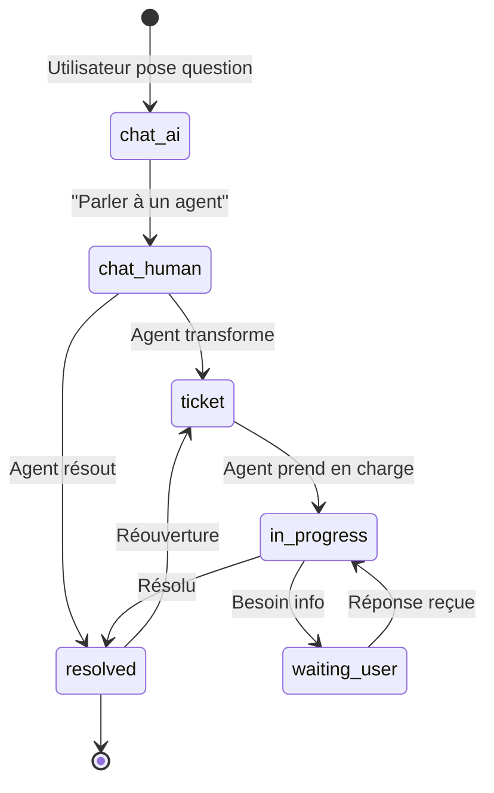
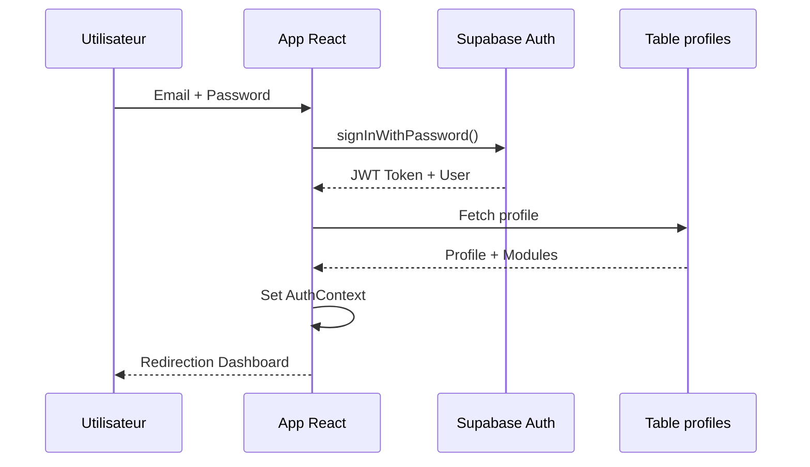
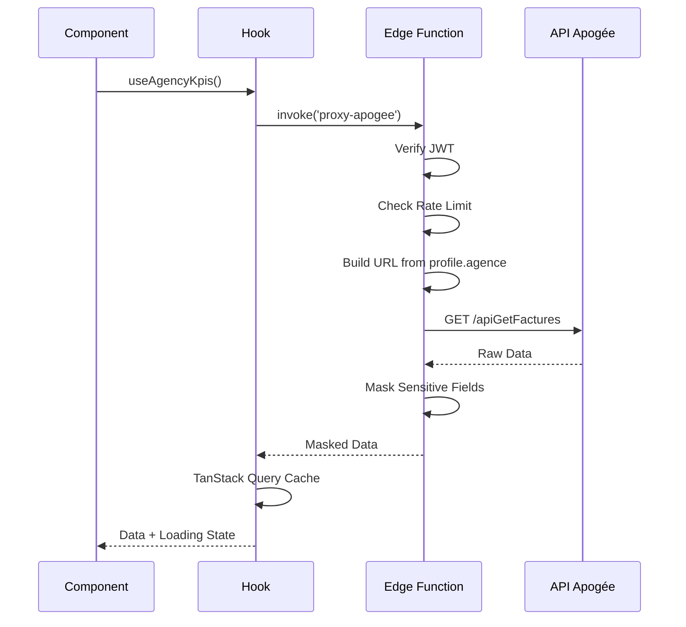
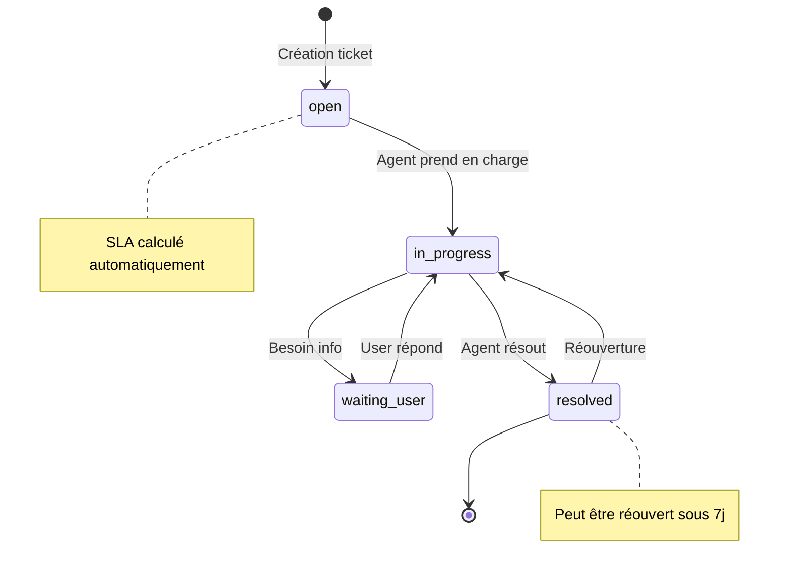

# 📚 Manuel Développeur HelpConfort

## Documentation Technique Exhaustive — Version 0.7.13

> **Objectif** : Ce document est la référence unique et complète pour tout développeur travaillant sur le projet HelpConfort. Il couvre l'architecture, les modules, la sécurité, les bonnes pratiques et tous les détails techniques nécessaires pour contribuer efficacement au projet.

---

## 📑 Table des Matières

### PARTIE 1 : DÉMARRAGE RAPIDE
- [Chapitre 1 — Onboarding Développeur](#chapitre-1--onboarding-développeur)
- [Chapitre 2 — Architecture Vue d'Ensemble](#chapitre-2--architecture-vue-densemble)

### PARTIE 2 : SYSTÈME DE PERMISSIONS
- [Chapitre 3 — Permissions V2 : Rôles Globaux (N0-N6)](#chapitre-3--permissions-v2--rôles-globaux-n0-n6)
- [Chapitre 4 — Modules Activables & Guards](#chapitre-4--modules-activables--guards)

### PARTIE 3 : MODULES FONCTIONNELS
- [Chapitre 5 — Help Academy (Guides & Documentation)](#chapitre-5--help-academy-guides--documentation)
- [Chapitre 6 — Pilotage Agence (KPIs & Indicateurs)](#chapitre-6--pilotage-agence-kpis--indicateurs)
- [Chapitre 7 — Support V2 (Tickets & Live Chat)](#chapitre-7--support-v2-tickets--live-chat)
- [Chapitre 8 — Réseau Franchiseur (Multi-agences)](#chapitre-8--réseau-franchiseur-multi-agences)
- [Chapitre 9 — Module RH & Parc](#chapitre-9--module-rh--parc)

### PARTIE 4 : MOTEUR STATIA
- [Chapitre 10 — StatIA : Métriques Centralisées](#chapitre-10--statia--métriques-centralisées)

### PARTIE 5 : BACKEND & EDGE FUNCTIONS
- [Chapitre 11 — Base de Données Supabase](#chapitre-11--base-de-données-supabase)
- [Chapitre 12 — Edge Functions](#chapitre-12--edge-functions)

### PARTIE 6 : API APOGÉE & SÉCURITÉ
- [Chapitre 13 — API Apogée (CRM Externe)](#chapitre-13--api-apogée-crm-externe)
- [Chapitre 14 — Sécurité Complète](#chapitre-14--sécurité-complète)

### PARTIE 7 : BONNES PRATIQUES & MAINTENANCE
- [Chapitre 15 — Conventions, Debugging & Maintenance](#chapitre-15--conventions-debugging--maintenance)

### ANNEXES
- [Annexe A — Schémas de Base de Données](#annexe-a--schémas-de-base-de-données)
- [Annexe B — Diagrammes de Flux](#annexe-b--diagrammes-de-flux)
- [Annexe C — Glossaire Métier](#annexe-c--glossaire-métier)
- [Annexe D — Checklist Pré-Production](#annexe-d--checklist-pré-production)

---

# PARTIE 1 : DÉMARRAGE RAPIDE

---

## Chapitre 1 — Onboarding Développeur

### 1.1 Présentation du Projet

**HelpConfort** est une plateforme SaaS B2B destinée aux franchises du réseau HelpConfort. Elle centralise :
- La documentation métier et la formation (Help Academy)
- Le pilotage commercial et les KPIs (Pilotage Agence)
- La gestion des tickets et le support (Support V2)
- La gestion multi-agences pour le siège (Réseau Franchiseur)
- La gestion RH et du parc véhicules (RH & Parc)
- L'administration globale de la plateforme (Admin)

**Contexte métier** : HelpConfort est un réseau de franchises spécialisées dans les travaux de dépannage, rénovation et maintenance pour particuliers et professionnels (assurances, bailleurs, syndics).

### 1.2 Prérequis Techniques

| Outil | Version Minimale | Installation |
|-------|------------------|--------------|
| Node.js | 18.x+ | `nvm install 18` |
| Bun | 1.0+ | `curl -fsSL https://bun.sh/install \| bash` |
| Git | 2.30+ | Via package manager |
| VSCode | Latest | Recommandé avec extensions |

**Extensions VSCode recommandées** :
- ESLint
- Prettier
- Tailwind CSS IntelliSense
- TypeScript Vue Plugin (Volar)
- GitLens

### 1.3 Installation Pas à Pas

```bash
# 1. Cloner le repository
git clone <repository-url>
cd helpconfort

# 2. Installer les dépendances
bun install

# 3. Lancer le serveur de développement
bun run dev

# 4. Ouvrir dans le navigateur
# http://localhost:5173
```

> ⚠️ **IMPORTANT** : Le fichier `.env` est **auto-généré** par Lovable Cloud. Ne JAMAIS le créer ou le modifier manuellement. Les variables d'environnement sont :
> - `VITE_SUPABASE_URL`
> - `VITE_SUPABASE_PUBLISHABLE_KEY`
> - `VITE_SUPABASE_PROJECT_ID`

### 1.4 Fichiers Critiques à Connaître

```
📁 Fichiers de Configuration
├── vite.config.ts          → Configuration Vite (aliasing @/)
├── tailwind.config.ts      → Design system (couleurs, fonts)
├── src/index.css           → Tokens CSS et variables globales
├── supabase/config.toml    → Configuration Edge Functions (verify_jwt)
└── src/App.tsx             → Point d'entrée, routes, providers

📁 Fichiers Métier Clés
├── src/config/routes.ts    → Définition centralisée des routes
├── src/config/roleMatrix.ts → Permissions et capacités par rôle
├── src/lib/logger.ts       → Logger centralisé (→ Sentry)
├── src/statia/domain/rules.ts → Règles métier HelpConfort
└── src/contexts/AuthContext.tsx → Contexte d'authentification
```

### 1.5 Comptes de Test par Rôle

| Rôle | Niveau | Email de test | Description |
|------|--------|---------------|-------------|
| Superadmin | N6 | superadmin@test.com | Accès total, droits absolus |
| Platform Admin | N5 | admin@test.com | Administration plateforme |
| Franchisor Admin | N4 | franchiseur-admin@test.com | Admin réseau franchiseur |
| Franchisor User | N3 | franchiseur@test.com | Utilisateur réseau (animateur) |
| Franchisee Admin | N2 | dirigeant@test.com | Dirigeant d'agence |
| Franchisee User | N1 | assistant@test.com | Employé agence (assistant, technicien) |
| Base User | N0 | externe@test.com | Utilisateur externe (agent support) |

> 💡 **Note** : Les comptes de test doivent être créés via l'interface d'administration. Mot de passe par défaut : généré avec `generateSecurePassword()` (18 caractères).

### 1.6 Structure du Projet

```
helpconfort/
├── docs/                    → Documentation technique
├── public/                  → Assets statiques
├── src/
│   ├── assets/              → Images, icônes
│   ├── components/          → Composants React réutilisables
│   │   ├── ui/              → Composants shadcn/ui
│   │   ├── admin/           → Composants administration
│   │   ├── support/         → Composants support
│   │   ├── apogee-connect/  → Composants intégration Apogée
│   │   └── ...
│   ├── config/              → Configuration (routes, permissions)
│   ├── contexts/            → React Contexts (Auth, Filters, etc.)
│   ├── hooks/               → Custom React Hooks
│   ├── integrations/        → Intégrations externes (Supabase)
│   ├── lib/                 → Utilitaires et helpers
│   ├── pages/               → Pages/Routes de l'application
│   ├── services/            → Services métier
│   ├── statia/              → Moteur de métriques StatIA
│   └── types/               → Définitions TypeScript
├── supabase/
│   ├── config.toml          → Configuration Supabase
│   └── functions/           → Edge Functions (41 fonctions)
│       ├── _shared/         → Helpers partagés (CORS, auth, rate limit)
│       └── [function-name]/ → Chaque fonction dans son dossier
└── tests/                   → Tests unitaires (Vitest)
```

### 1.7 FAQ Onboarding

**Q: Je n'arrive pas à me connecter, que faire ?**
R: Vérifiez que l'utilisateur existe dans la table `profiles` avec un `global_role` valide. Utilisez l'outil de debugging Supabase (Cloud > Database).

**Q: Les Edge Functions ne répondent pas**
R: Vérifiez que `verify_jwt = true` dans `config.toml` et que vous utilisez `supabase.functions.invoke()` (pas `fetch`).

**Q: Je vois des données d'une autre agence**
R: C'est un bug CRITIQUE. Vérifiez que l'URL Apogée est construite dynamiquement avec `profile.agence` et non hardcodée.

**Q: Comment créer une nouvelle page ?**
R: 
1. Créer le fichier dans `src/pages/`
2. Ajouter la route dans `src/config/routes.ts`
3. Ajouter la route dans `App.tsx` avec les guards appropriés
4. Ajouter l'entrée dans la navigation (sidebar/tiles)

---

## Chapitre 2 — Architecture Vue d'Ensemble

### 2.1 Stack Technique Complet

| Couche | Technologie | Version | Rôle |
|--------|-------------|---------|------|
| **Frontend** | React | 18.3.1 | Framework UI |
| | TypeScript | 5.x | Typage statique |
| | Vite | 5.x | Build tool |
| | Tailwind CSS | 3.x | Styling |
| | shadcn/ui | Latest | Composants UI |
| | TanStack Query | 5.x | Data fetching & cache |
| | React Router | 6.x | Routing |
| | Framer Motion | 12.x | Animations |
| **Backend** | Supabase | Cloud | BaaS complet |
| | PostgreSQL | 15 | Base de données |
| | Edge Functions | Deno | Logique serveur |
| **IA** | Lovable AI | - | Gateway IA (Gemini, GPT) |
| | OpenAI | GPT-4o | Embeddings, classification |
| **Monitoring** | Sentry | 10.x | Error tracking |
| **APIs Externes** | Apogée API | REST | CRM HelpConfort |

### 2.2 Diagramme d'Architecture Global

```
┌─────────────────────────────────────────────────────────────────────┐
│                           CLIENT (Browser)                          │
├─────────────────────────────────────────────────────────────────────┤
│  React App                                                          │
│  ├── Pages (Routes protégées par Guards)                            │
│  ├── Contexts (Auth, Filters, Agency, Franchiseur)                  │
│  ├── Hooks (useQuery, useMutation avec TanStack Query)              │
│  └── Components (shadcn/ui + custom)                                │
└─────────────────────────────┬───────────────────────────────────────┘
                              │
                              ▼
┌─────────────────────────────────────────────────────────────────────┐
│                         SUPABASE CLOUD                              │
├─────────────────────────────────────────────────────────────────────┤
│  ┌─────────────┐  ┌─────────────┐  ┌─────────────┐                  │
│  │    Auth     │  │  Database   │  │   Storage   │                  │
│  │   (JWT)     │  │  (Postgres) │  │  (Buckets)  │                  │
│  └──────┬──────┘  └──────┬──────┘  └──────┬──────┘                  │
│         │                │                │                         │
│         └────────────────┼────────────────┘                         │
│                          │                                          │
│  ┌───────────────────────┼───────────────────────┐                  │
│  │              Edge Functions (41)              │                  │
│  │  ├── proxy-apogee (API Apogée)                │                  │
│  │  ├── chat-guide (RAG + IA)                    │                  │
│  │  ├── notify-* (Notifications SMS/Email)       │                  │
│  │  ├── auto-classify-* (Classification IA)      │                  │
│  │  └── ...                                       │                  │
│  └───────────────────────┬───────────────────────┘                  │
└──────────────────────────┼──────────────────────────────────────────┘
                           │
                           ▼
┌─────────────────────────────────────────────────────────────────────┐
│                        SERVICES EXTERNES                            │
├─────────────────────────────────────────────────────────────────────┤
│  ┌─────────────┐  ┌─────────────┐  ┌─────────────┐  ┌─────────────┐ │
│  │ API Apogée  │  │ Lovable AI  │  │   OpenAI    │  │  AllMySMS   │ │
│  │   (CRM)     │  │  (Gateway)  │  │ (Embeddings)│  │   (SMS)     │ │
│  └─────────────┘  └─────────────┘  └─────────────┘  └─────────────┘ │
└─────────────────────────────────────────────────────────────────────┘
```

### 2.3 Flux de Données Typique

```
1. Utilisateur → Clique sur "Mon Agence"
2. Router → Vérifie AuthContext.isAuthenticated
3. RoleGuard → Vérifie hasMinimumRole(N1)
4. ModuleGuard → Vérifie hasModule("pilotage_agence")
5. Page → Appelle useAgencyKpis() hook
6. Hook → supabase.functions.invoke("proxy-apogee", { endpoint: "apiGetFactures" })
7. Edge Function → Vérifie JWT, rate limit, CORS
8. Edge Function → Appelle https://{agence}.hc-apogee.fr/api/apiGetFactures
9. Edge Function → Masque données sensibles, retourne réponse
10. Hook → TanStack Query cache les données
11. Composant → Affiche les KPIs
```

### 2.4 Patterns Architecturaux Clés

#### Pattern 1 : Context + Hook + Component

```typescript
// 1. Context (src/contexts/AuthContext.tsx)
export const AuthContext = createContext<AuthContextType | undefined>(undefined);

// 2. Hook (src/hooks/useAuth.ts)
export const useAuth = () => {
  const context = useContext(AuthContext);
  if (!context) throw new Error("useAuth must be within AuthProvider");
  return context;
};

// 3. Component (src/components/SomeComponent.tsx)
const SomeComponent = () => {
  const { user, globalRole, hasModule } = useAuth();
  // ...
};
```

#### Pattern 2 : Safe Fetching (Anti-undefined)

```typescript
// ❌ INTERDIT - peut retourner undefined
const { data } = useQuery({
  queryKey: ["data"],
  queryFn: async () => {
    const { data } = await supabase.from("table").select();
    return data; // Peut être null/undefined
  }
});

// ✅ OBLIGATOIRE - retourne toujours un objet valide
const { data } = useQuery({
  queryKey: ["data"],
  queryFn: async () => {
    const { data, error } = await supabase.from("table").select();
    if (error) throw error;
    return data ?? []; // Toujours un tableau
  }
});
```

#### Pattern 3 : Guards en Cascade

```tsx
// App.tsx - Protection multi-niveaux
<Route
  path="/admin/*"
  element={
    <RoleGuard minRole="platform_admin">        {/* Niveau 1: Rôle N5+ */}
      <ModuleGuard moduleKey="admin_plateforme"> {/* Niveau 2: Module activé */}
        <AdminLayout>
          <Outlet />
        </AdminLayout>
      </ModuleGuard>
    </RoleGuard>
  }
/>
```

### 2.5 Gestion des États

| Type d'état | Solution | Exemple |
|-------------|----------|---------|
| État serveur (données BDD) | TanStack Query | `useQuery`, `useMutation` |
| État global UI | React Context | `AuthContext`, `FiltersContext` |
| État local composant | useState | Formulaires, modals |
| État URL | React Router | Paramètres, query strings |
| État persistant | sessionStorage | Filtres franchiseur |

### 2.6 Règles d'Or de l'Architecture

1. **Jamais de `console.log`** → Utiliser `logError()` ou `logInfo()` de `src/lib/logger.ts`
2. **Jamais de couleurs hardcodées** → Utiliser les tokens Tailwind (`text-foreground`, `bg-primary`)
3. **Jamais d'appels API directs** → Passer par les Edge Functions pour les APIs externes
4. **Jamais de données sensibles côté client** → Masquage server-side obligatoire
5. **Toujours vérifier le rôle ET le module** → Double protection routes
6. **Toujours typer les réponses** → Pas de `any`, interfaces explicites

---

# PARTIE 2 : SYSTÈME DE PERMISSIONS

---

## Chapitre 3 — Permissions V2 : Rôles Globaux (N0-N6)

### 3.1 Philosophie du Système

Le système de permissions V2 repose sur deux piliers :
1. **Rôle Global (global_role)** : Niveau hiérarchique N0 à N6
2. **Modules Activables (enabled_modules)** : Fonctionnalités granulaires

Cette architecture permet :
- Un contrôle hiérarchique simple (qui peut voir quoi)
- Une activation fine des fonctionnalités (quelles features sont disponibles)
- Une compatibilité avec les cas spéciaux (agent support externe N0 avec module support)

### 3.2 Hiérarchie des 7 Rôles

| Niveau | Constante | Label FR | Description | Accès Type |
|--------|-----------|----------|-------------|------------|
| **N6** | `superadmin` | Super Administrateur | Droits absolus, peut tout faire | Tout |
| **N5** | `platform_admin` | Administrateur Plateforme | Gestion globale, bypass modules | Admin + Tout |
| **N4** | `franchisor_admin` | Admin Franchiseur | Admin du réseau franchiseur | Réseau + Multi-agences |
| **N3** | `franchisor_user` | Utilisateur Franchiseur | Animateur réseau | Réseau (agences assignées) |
| **N2** | `franchisee_admin` | Dirigeant Agence | Gérant d'une agence | Agence complète |
| **N1** | `franchisee_user` | Utilisateur Agence | Employé (assistant, tech) | Agence (limité) |
| **N0** | `base_user` | Utilisateur de Base | Externe, accès minimal | Modules activés uniquement |

### 3.3 ROLE_MATRIX Détaillée

```typescript
// src/config/roleMatrix.ts

export const ROLE_MATRIX: Record<GlobalRole, RoleCapabilities> = {
  superadmin: {
    level: 6,
    label: 'Super Administrateur',
    canManageUsers: true,
    canAccessAdmin: true,
    canAccessSupport: true,
    canAccessFranchiseur: true,
    canAccessAgency: true,
    canBypassModules: true,      // ← Ignore les vérifications de modules
    maxAssignableRole: 'superadmin',
  },
  platform_admin: {
    level: 5,
    label: 'Administrateur Plateforme',
    canManageUsers: true,
    canAccessAdmin: true,
    canAccessSupport: true,
    canAccessFranchiseur: true,
    canAccessAgency: true,
    canBypassModules: true,
    maxAssignableRole: 'franchisor_admin',
  },
  franchisor_admin: {
    level: 4,
    label: 'Admin Franchiseur',
    canManageUsers: true,
    canAccessAdmin: false,
    canAccessSupport: true,
    canAccessFranchiseur: true,
    canAccessAgency: true,
    canBypassModules: false,
    maxAssignableRole: 'franchisor_user',
  },
  franchisor_user: {
    level: 3,
    label: 'Utilisateur Franchiseur',
    canManageUsers: false,
    canAccessAdmin: false,
    canAccessSupport: true,
    canAccessFranchiseur: true,
    canAccessAgency: true,
    canBypassModules: false,
    maxAssignableRole: 'franchisee_admin',
  },
  franchisee_admin: {
    level: 2,
    label: 'Dirigeant Agence',
    canManageUsers: true,         // Peut créer des N1 dans son agence
    canAccessAdmin: false,
    canAccessSupport: true,
    canAccessFranchiseur: false,
    canAccessAgency: true,
    canBypassModules: false,
    maxAssignableRole: 'franchisee_user',
  },
  franchisee_user: {
    level: 1,
    label: 'Utilisateur Agence',
    canManageUsers: false,
    canAccessAdmin: false,
    canAccessSupport: true,
    canAccessFranchiseur: false,
    canAccessAgency: true,
    canBypassModules: false,
    maxAssignableRole: null,
  },
  base_user: {
    level: 0,
    label: 'Utilisateur de Base',
    canManageUsers: false,
    canAccessAdmin: false,
    canAccessSupport: false,      // Sauf si module support activé
    canAccessFranchiseur: false,
    canAccessAgency: false,
    canBypassModules: false,
    maxAssignableRole: null,
  },
};
```

### 3.4 Fonctions SQL RLS Critiques

Ces fonctions sont définies comme `SECURITY DEFINER` pour éviter les boucles RLS :

```sql
-- Vérifie si un utilisateur a au moins le niveau de rôle spécifié
CREATE OR REPLACE FUNCTION public.has_min_global_role(_user_id uuid, _min_level integer)
RETURNS boolean
LANGUAGE sql
STABLE SECURITY DEFINER
SET search_path = public
AS $$
  SELECT EXISTS (
    SELECT 1 FROM public.profiles
    WHERE id = _user_id
    AND (
      CASE global_role
        WHEN 'superadmin' THEN 6
        WHEN 'platform_admin' THEN 5
        WHEN 'franchisor_admin' THEN 4
        WHEN 'franchisor_user' THEN 3
        WHEN 'franchisee_admin' THEN 2
        WHEN 'franchisee_user' THEN 1
        WHEN 'base_user' THEN 0
        ELSE 0
      END
    ) >= _min_level
  )
$$;

-- Récupère l'agence de l'utilisateur
CREATE OR REPLACE FUNCTION public.get_user_agency(_user_id uuid)
RETURNS text
LANGUAGE sql
STABLE SECURITY DEFINER
SET search_path = public
AS $$
  SELECT agence FROM profiles WHERE id = _user_id
$$;

-- Récupère l'ID d'agence de l'utilisateur
CREATE OR REPLACE FUNCTION public.get_user_agency_id(_user_id uuid)
RETURNS uuid
LANGUAGE sql
STABLE SECURITY DEFINER
SET search_path = public
AS $$
  SELECT agency_id FROM profiles WHERE id = _user_id
$$;

-- Vérifie si l'utilisateur est admin
CREATE OR REPLACE FUNCTION public.is_admin(_user_id uuid)
RETURNS boolean
LANGUAGE sql
STABLE SECURITY DEFINER
SET search_path = public
AS $$
  SELECT has_min_global_role(_user_id, 5)
$$;

-- Vérifie l'accès à la console support
CREATE OR REPLACE FUNCTION public.has_support_access(_user_id uuid)
RETURNS boolean
LANGUAGE sql
STABLE SECURITY DEFINER
SET search_path = public
AS $$
  SELECT EXISTS (
    SELECT 1
    FROM public.profiles
    WHERE id = _user_id
    AND (
      (enabled_modules->'support'->'options'->>'agent')::boolean = true
      OR global_role IN ('platform_admin', 'superadmin')
    )
  )
$$;

-- Vérifie si l'utilisateur est agent support
CREATE OR REPLACE FUNCTION public.is_support_agent(_user_id uuid)
RETURNS boolean
LANGUAGE sql
STABLE SECURITY DEFINER
SET search_path = public
AS $$
  SELECT COALESCE(
    (enabled_modules->'support'->'options'->>'agent')::boolean,
    false
  )
  FROM profiles
  WHERE id = _user_id;
$$;

-- Vérifie l'accès franchiseur
CREATE OR REPLACE FUNCTION public.has_franchiseur_access(_user_id uuid)
RETURNS boolean
LANGUAGE sql
STABLE SECURITY DEFINER
SET search_path = public
AS $$
  SELECT EXISTS (
    SELECT 1
    FROM public.profiles
    WHERE id = _user_id
    AND (
      (enabled_modules->'reseau_franchiseur'->>'enabled')::boolean = true
      OR global_role IN ('franchisor_user', 'franchisor_admin', 'platform_admin', 'superadmin')
    )
  )
$$;
```

### 3.5 Gestion des Utilisateurs : Qui Peut Créer Qui ?

| Créateur | Peut créer | Limite |
|----------|-----------|--------|
| N6 (Superadmin) | N0 à N6 | Illimité, peut se modifier lui-même |
| N5 (Platform Admin) | N0 à N4 | Ne peut pas créer de N5/N6 |
| N4 (Franchisor Admin) | N0 à N3 | Dans son périmètre réseau |
| N3 (Franchisor User) | N0 à N2 | Dans ses agences assignées |
| N2 (Franchisee Admin) | N0 à N1 | Dans son agence uniquement |
| N1, N0 | Aucun | Pas de droit de création |

**Règle spéciale N6** : Un superadmin peut modifier son propre profil pour s'ajouter des modules. C'est la seule exception à la règle "on ne peut pas modifier un utilisateur de même niveau".

### 3.6 Utilisation Côté Frontend

```typescript
// Dans un composant
import { useAuth } from "@/hooks/useAuth";

const MyComponent = () => {
  const { 
    user,                    // Objet User Supabase
    profile,                 // Profil complet avec modules
    globalRole,              // 'superadmin' | 'platform_admin' | ...
    globalRoleLevel,         // 0-6
    hasMinimumRole,          // (role: GlobalRole) => boolean
    hasModule,               // (key: string) => boolean
    hasModuleOption,         // (key: string, option: string) => boolean
    isAdmin,                 // globalRoleLevel >= 5
    isFranchisor,            // globalRoleLevel >= 3
    canAccessSupportConsole, // hasModule('support') && hasModuleOption('support', 'agent')
  } = useAuth();

  // Exemple d'utilisation
  if (!hasMinimumRole('franchisee_admin')) {
    return <AccessDenied />;
  }

  if (hasModule('pilotage_agence')) {
    // Afficher les KPIs
  }

  return <div>...</div>;
};
```

---

## Chapitre 4 — Modules Activables & Guards

### 4.1 Structure `enabled_modules`

Le champ `enabled_modules` dans la table `profiles` est un JSONB avec la structure suivante :

```typescript
interface EnabledModules {
  [moduleKey: string]: {
    enabled: boolean;
    options?: {
      [optionKey: string]: boolean | string | number;
    };
  };
}

// Exemple concret
const enabledModules: EnabledModules = {
  "help_academy": {
    enabled: true
  },
  "pilotage_agence": {
    enabled: true,
    options: {
      diffusion: true,
      export: false
    }
  },
  "support": {
    enabled: true,
    options: {
      agent: true,        // Accès console support
      live_chat: true     // Peut gérer le chat en direct
    }
  },
  "rh": {
    enabled: true,
    options: {
      coffre: true,       // Accès coffre-fort personnel
      rh_viewer: true,    // Visualisation équipe
      rh_admin: false     // Administration RH
    }
  },
  "apogee_tickets": {
    enabled: true,
    options: {
      kanban: true,       // Vue Kanban
      manage: true,       // Édition tickets
      import: false       // Import Excel
    }
  }
};
```

### 4.2 Liste des Modules Disponibles

| Module Key | Label | Description | Options |
|------------|-------|-------------|---------|
| `help_academy` | Help Academy | Guides et documentation | - |
| `pilotage_agence` | Pilotage Agence | KPIs et statistiques | `diffusion`, `export` |
| `support` | Support | Tickets et assistance | `agent`, `live_chat` |
| `reseau_franchiseur` | Réseau Franchiseur | Multi-agences | `visits`, `royalties` |
| `rh` | RH | Gestion collaborateurs | `coffre`, `rh_viewer`, `rh_admin` |
| `parc` | Parc | Véhicules et équipements | `vehicles`, `equipment` |
| `apogee_tickets` | Gestion de Projet | Ticketing interne | `kanban`, `manage`, `import` |
| `admin_plateforme` | Administration | Config plateforme | `users`, `agencies`, `system` |
| `commercial` | Commercial | PPTX et devis | `pptx_generator` |
| `maintenance` | Maintenance | Logs système | `advanced` |

### 4.3 MODULE_DEFINITIONS

```typescript
// src/config/roleMatrix.ts

export const MODULE_DEFINITIONS: Record<string, ModuleDefinition> = {
  help_academy: {
    key: 'help_academy',
    label: 'Help Academy',
    description: 'Accès aux guides et documentation',
    minRole: 'franchisee_user',  // N1 minimum
    options: []
  },
  pilotage_agence: {
    key: 'pilotage_agence',
    label: 'Pilotage Agence',
    description: 'Tableaux de bord et KPIs',
    minRole: 'franchisee_user',
    options: [
      { key: 'diffusion', label: 'Mode Diffusion TV' },
      { key: 'export', label: 'Export données' }
    ]
  },
  support: {
    key: 'support',
    label: 'Support',
    description: 'Gestion des demandes support',
    minRole: 'base_user',  // N0 peut avoir le module (agent externe)
    options: [
      { key: 'agent', label: 'Agent Support (Console)', minRole: 'base_user' },
      { key: 'live_chat', label: 'Chat en direct', minRole: 'franchisor_user' }
    ]
  },
  rh: {
    key: 'rh',
    label: 'Ressources Humaines',
    description: 'Gestion RH collaborateurs',
    minRole: 'franchisee_user',
    options: [
      { key: 'coffre', label: 'Coffre-fort personnel', minRole: 'franchisee_user' },
      { key: 'rh_viewer', label: 'Visualisation équipe', minRole: 'franchisee_admin' },
      { key: 'rh_admin', label: 'Administration RH', minRole: 'franchisee_admin' }
    ]
  },
  apogee_tickets: {
    key: 'apogee_tickets',
    label: 'Gestion de Projet',
    description: 'Ticketing et suivi développements',
    minRole: 'franchisee_user',
    options: [
      { key: 'kanban', label: 'Vue Kanban' },
      { key: 'manage', label: 'Édition tickets' },
      { key: 'import', label: 'Import Excel' }
    ]
  },
  reseau_franchiseur: {
    key: 'reseau_franchiseur',
    label: 'Réseau Franchiseur',
    description: 'Gestion multi-agences',
    minRole: 'franchisor_user',  // N3 minimum
    options: [
      { key: 'visits', label: 'Visites agences' },
      { key: 'royalties', label: 'Calcul redevances' }
    ]
  },
  admin_plateforme: {
    key: 'admin_plateforme',
    label: 'Administration',
    description: 'Configuration plateforme',
    minRole: 'platform_admin',  // N5 minimum
    options: [
      { key: 'users', label: 'Gestion utilisateurs' },
      { key: 'agencies', label: 'Gestion agences' },
      { key: 'system', label: 'Paramètres système' }
    ]
  }
};
```

### 4.4 Guards UI

#### RoleGuard

```tsx
// src/guards/RoleGuard.tsx

interface RoleGuardProps {
  minRole: GlobalRole;
  children: React.ReactNode;
  fallback?: React.ReactNode;
}

export const RoleGuard: React.FC<RoleGuardProps> = ({
  minRole,
  children,
  fallback = <AccessDenied />
}) => {
  const { hasMinimumRole, isLoading } = useAuth();
  
  if (isLoading) return <LoadingSpinner />;
  if (!hasMinimumRole(minRole)) return fallback;
  
  return <>{children}</>;
};

// Utilisation
<RoleGuard minRole="franchisee_admin">
  <SensitiveComponent />
</RoleGuard>
```

#### ModuleGuard

```tsx
// src/guards/ModuleGuard.tsx

interface ModuleGuardProps {
  moduleKey: string;
  requiredOptions?: string[];
  children: React.ReactNode;
  fallback?: React.ReactNode;
}

export const ModuleGuard: React.FC<ModuleGuardProps> = ({
  moduleKey,
  requiredOptions = [],
  children,
  fallback = <ModuleNotEnabled />
}) => {
  const { hasModule, hasModuleOption, isAdmin, isLoading } = useAuth();
  
  if (isLoading) return <LoadingSpinner />;
  
  // Les admins (N5+) bypass les vérifications de modules
  if (isAdmin) return <>{children}</>;
  
  // Vérifier le module
  if (!hasModule(moduleKey)) return fallback;
  
  // Vérifier les options requises
  for (const option of requiredOptions) {
    if (!hasModuleOption(moduleKey, option)) return fallback;
  }
  
  return <>{children}</>;
};

// Utilisation
<ModuleGuard moduleKey="rh" requiredOptions={["rh_admin"]}>
  <SalaryManagement />
</ModuleGuard>
```

#### SupportConsoleGuard

```tsx
// src/guards/SupportConsoleGuard.tsx

export const SupportConsoleGuard: React.FC<{ children: React.ReactNode }> = ({ children }) => {
  const { canAccessSupportConsole, isAdmin, isLoading } = useAuth();
  
  if (isLoading) return <LoadingSpinner />;
  if (!canAccessSupportConsole && !isAdmin) {
    return <Navigate to="/" replace />;
  }
  
  return <>{children}</>;
};
```

### 4.5 Protection des Routes dans App.tsx

```tsx
// src/App.tsx (extrait)

<Routes>
  {/* Routes publiques */}
  <Route path="/login" element={<Login />} />
  <Route path="/signup" element={<Signup />} />
  
  {/* Routes protégées - Authentification requise */}
  <Route element={<ProtectedRoute />}>
    
    {/* Dashboard */}
    <Route path="/" element={<Landing />} />
    
    {/* Help Academy - N1+ avec module */}
    <Route path="/academy/*" element={
      <RoleGuard minRole="franchisee_user">
        <ModuleGuard moduleKey="help_academy">
          <AcademyLayout>
            <Outlet />
          </AcademyLayout>
        </ModuleGuard>
      </RoleGuard>
    }>
      <Route index element={<AcademyHome />} />
      <Route path=":categorySlug" element={<CategoryPage />} />
      <Route path=":categorySlug/:blockSlug" element={<BlockPage />} />
    </Route>
    
    {/* Pilotage Agence - N1+ avec module */}
    <Route path="/hc-agency/*" element={
      <RoleGuard minRole="franchisee_user">
        <ModuleGuard moduleKey="pilotage_agence">
          <AgencyLayout>
            <Outlet />
          </AgencyLayout>
        </ModuleGuard>
      </RoleGuard>
    }>
      <Route index element={<AgencyHome />} />
      <Route path="stats-hub" element={<StatsHub />} />
      <Route path="actions" element={<ActionsAMener />} />
    </Route>
    
    {/* Réseau Franchiseur - N3+ avec module */}
    <Route path="/hc-reseau/*" element={
      <RoleGuard minRole="franchisor_user">
        <ModuleGuard moduleKey="reseau_franchiseur">
          <FranchiseurLayout>
            <Outlet />
          </FranchiseurLayout>
        </ModuleGuard>
      </RoleGuard>
    }>
      <Route index element={<FranchiseurHome />} />
      <Route path="agences" element={<AgenciesManagement />} />
      <Route path="tableaux" element={<NetworkStats />} />
    </Route>
    
    {/* Administration - N5+ */}
    <Route path="/admin/*" element={
      <RoleGuard minRole="platform_admin">
        <AdminLayout>
          <Outlet />
        </AdminLayout>
      </RoleGuard>
    }>
      <Route index element={<AdminHome />} />
      <Route path="utilisateurs" element={<UsersManagement />} />
      <Route path="agences" element={<AgenciesAdmin />} />
      <Route path="system-health" element={<SystemHealth />} />
    </Route>
    
    {/* Console Support - Module support.agent requis */}
    <Route path="/support/console/*" element={
      <SupportConsoleGuard>
        <SupportConsoleLayout>
          <Outlet />
        </SupportConsoleLayout>
      </SupportConsoleGuard>
    }>
      <Route index element={<SupportConsole />} />
      <Route path="ticket/:ticketId" element={<TicketDetail />} />
    </Route>
    
  </Route>
</Routes>
```

### 4.6 Cas d'Usage Spéciaux

#### Agent Support Externe (N0 + support.agent)

Un utilisateur N0 (base_user) peut accéder à la console support s'il a :
- `enabled_modules.support.enabled = true`
- `enabled_modules.support.options.agent = true`

Ce cas permet d'avoir des agents support externes (freelance, prestataire) sans leur donner accès aux autres fonctionnalités.

```json
// Profile d'un agent support externe
{
  "global_role": "base_user",
  "enabled_modules": {
    "support": {
      "enabled": true,
      "options": {
        "agent": true
      }
    }
  },
  "support_level": 1  // SA1
}
```

#### Animateur avec Agences Assignées

Un N3 (franchisor_user) sans assignation voit toutes les agences. Avec des assignations, il ne voit que ses agences.

```sql
-- Table des assignations
CREATE TABLE franchiseur_agency_assignments (
  id UUID PRIMARY KEY DEFAULT gen_random_uuid(),
  user_id UUID REFERENCES profiles(id) NOT NULL,
  agency_id UUID REFERENCES apogee_agencies(id) NOT NULL,
  assigned_at TIMESTAMP WITH TIME ZONE DEFAULT now(),
  assigned_by UUID REFERENCES profiles(id),
  UNIQUE(user_id, agency_id)
);
```

---

# PARTIE 3 : MODULES FONCTIONNELS

---

## Chapitre 5 — Help Academy (Guides & Documentation)

### 5.1 Présentation

Help Academy est le module de documentation et formation de la plateforme. Il comprend :
- **Guide Apogée** : Documentation du CRM Apogée
- **Guide Apporteurs** : Procédures par type d'apporteur (assurance, syndic, etc.)
- **Documentation HelpConfort** : Règles métier, processus franchise

### 5.2 Structure des Routes

```
/academy                     → Page d'accueil Academy
/academy/apogee              → Guide Apogée (blocs)
/academy/apogee/:blockSlug   → Détail d'un bloc Apogée
/academy/apporteurs          → Guide Apporteurs (blocs spécifiques)
/academy/apporteurs/:blockSlug → Détail d'un bloc Apporteur
/academy/helpconfort         → Documentation HelpConfort
/academy/helpconfort/:blockSlug → Détail d'un bloc HelpConfort
```

### 5.3 Tables de Base de Données

```sql
-- Table principale des blocs de contenu
CREATE TABLE public.blocks (
  id UUID PRIMARY KEY DEFAULT gen_random_uuid(),
  title TEXT NOT NULL,
  slug TEXT NOT NULL UNIQUE,
  content TEXT DEFAULT '',           -- Contenu HTML (TipTap)
  type TEXT NOT NULL,                -- 'category' | 'block' | 'section'
  parent_id UUID REFERENCES blocks(id),
  "order" INTEGER DEFAULT 0,
  icon TEXT,                         -- Nom icône Lucide
  color_preset TEXT DEFAULT 'blue',
  summary TEXT,                      -- Résumé pour carte
  show_summary BOOLEAN DEFAULT false,
  hide_from_sidebar BOOLEAN DEFAULT false,
  hide_title BOOLEAN DEFAULT false,
  is_empty BOOLEAN DEFAULT false,
  is_in_progress BOOLEAN DEFAULT false,
  completed_at TIMESTAMP WITH TIME ZONE,
  tips_type TEXT,                    -- 'tip' | 'warning' | 'info'
  content_type TEXT,                 -- 'apogee' | 'helpconfort' | 'apporteurs'
  attachments JSONB DEFAULT '[]',    -- Pièces jointes
  created_at TIMESTAMP WITH TIME ZONE DEFAULT now(),
  updated_at TIMESTAMP WITH TIME ZONE DEFAULT now(),
  content_updated_at TIMESTAMP WITH TIME ZONE
);

-- Table des blocs apporteurs (structure similaire)
CREATE TABLE public.apporteur_blocks (
  id UUID PRIMARY KEY DEFAULT gen_random_uuid(),
  title TEXT NOT NULL,
  slug TEXT NOT NULL UNIQUE,
  content TEXT DEFAULT '',
  type TEXT NOT NULL,
  parent_id UUID REFERENCES apporteur_blocks(id),
  "order" INTEGER DEFAULT 0,
  -- ... mêmes champs que blocks
);

-- Table des catégories (navigation)
CREATE TABLE public.categories (
  id UUID PRIMARY KEY DEFAULT gen_random_uuid(),
  title TEXT NOT NULL,
  icon TEXT DEFAULT 'folder',
  color_preset TEXT DEFAULT 'blue',
  display_order INTEGER DEFAULT 0,
  scope TEXT NOT NULL,               -- 'apogee' | 'helpconfort' | 'apporteurs'
  created_at TIMESTAMP WITH TIME ZONE DEFAULT now(),
  updated_at TIMESTAMP WITH TIME ZONE DEFAULT now()
);

-- Table des favoris utilisateur
CREATE TABLE public.favorites (
  id UUID PRIMARY KEY DEFAULT gen_random_uuid(),
  user_id UUID NOT NULL,
  block_id UUID NOT NULL,
  block_slug TEXT NOT NULL,
  block_title TEXT NOT NULL,
  category_slug TEXT NOT NULL,
  scope TEXT DEFAULT 'apogee',
  created_at TIMESTAMP WITH TIME ZONE DEFAULT now()
);
```

### 5.4 Éditeur TipTap

L'éditeur utilise TipTap avec les extensions suivantes :

```typescript
// src/components/editor/TipTapEditor.tsx

import { useEditor, EditorContent } from '@tiptap/react';
import StarterKit from '@tiptap/starter-kit';
import Image from '@tiptap/extension-image';
import Table from '@tiptap/extension-table';
import TableRow from '@tiptap/extension-table-row';
import TableCell from '@tiptap/extension-table-cell';
import TableHeader from '@tiptap/extension-table-header';
import TextAlign from '@tiptap/extension-text-align';
import Highlight from '@tiptap/extension-highlight';
import Color from '@tiptap/extension-color';
import TextStyle from '@tiptap/extension-text-style';
import FontFamily from '@tiptap/extension-font-family';

const extensions = [
  StarterKit.configure({
    heading: { levels: [1, 2, 3, 4] }
  }),
  Image.configure({ inline: true }),
  Table.configure({ resizable: true }),
  TableRow,
  TableCell,
  TableHeader,
  TextAlign.configure({ types: ['heading', 'paragraph'] }),
  Highlight.configure({ multicolor: true }),
  Color,
  TextStyle,
  FontFamily,
];
```

### 5.5 Contextes

```typescript
// src/contexts/EditorContext.tsx
// Gère l'état d'édition des blocs Apogée/HelpConfort

export interface EditorContextType {
  isEditing: boolean;
  setIsEditing: (editing: boolean) => void;
  currentBlock: Block | null;
  setCurrentBlock: (block: Block | null) => void;
  saveBlock: (content: string) => Promise<void>;
  isSaving: boolean;
}

// src/contexts/ApporteurEditorContext.tsx
// Gère l'état d'édition des blocs Apporteurs (structure similaire)
```

### 5.6 Hooks Principaux

```typescript
// Récupérer tous les blocs d'un scope
const { data: blocks } = useBlocks('apogee');

// Récupérer un bloc par slug
const { data: block } = useBlockBySlug('apogee', 'factures');

// Mettre à jour un bloc
const mutation = useUpdateBlock();
await mutation.mutateAsync({ id: block.id, content: newContent });

// Gérer les favoris
const { data: favorites } = useFavorites();
const addFavorite = useAddFavorite();
const removeFavorite = useRemoveFavorite();
```

### 5.7 Workflow Publication

1. **Création** : Admin crée un bloc via l'interface d'édition
2. **Rédaction** : Contenu écrit avec TipTap
3. **Statut** : `is_in_progress` pour les brouillons
4. **Publication** : `is_in_progress = false` et `completed_at = now()`
5. **Indexation RAG** : Le contenu est chunké et vectorisé automatiquement

---

## Chapitre 6 — Pilotage Agence (KPIs & Indicateurs)

### 6.1 Présentation

Le module Pilotage Agence permet aux dirigeants et employés d'agence de visualiser leurs indicateurs de performance commerciale, extraits du CRM Apogée.

### 6.2 Structure des Routes

```
/hc-agency                    → Dashboard Mon Agence
/hc-agency/stats-hub          → Stats Hub unifié (5 onglets)
/hc-agency/actions            → Actions à mener
/hc-agency/veille-apporteurs  → Veille apporteurs
/hc-agency/planning           → Planning techniciens
/hc-agency/equipe             → Gestion équipe
/diffusion                    → Mode TV (affichage continu)
```

### 6.3 Architecture apogee-connect

```
src/components/apogee-connect/
├── contexts/
│   ├── AgencyContext.tsx       → Contexte agence courante
│   └── FiltersContext.tsx      → Filtres période/technicien/univers
├── services/
│   ├── dataService.ts          → Chargement données Apogée
│   ├── apogeeProxy.ts          → Appels Edge Function proxy
│   └── semaphore.ts            → Gestion concurrence (15 max)
├── types/
│   └── apogeeTypes.ts          → Interfaces données Apogée
├── hooks/
│   ├── useAgencyData.ts        → Hook chargement données
│   ├── useAgencyKpis.ts        → Hook calcul KPIs
│   └── useFilters.ts           → Hook gestion filtres
└── components/
    ├── KPICard.tsx             → Carte indicateur
    ├── StatsHub/               → Composants Stats Hub
    └── charts/                 → Graphiques Recharts
```

### 6.4 FiltersContext

```typescript
// src/components/apogee-connect/contexts/FiltersContext.tsx

interface FiltersContextType {
  // Période
  period: PeriodType;           // 'month' | 'quarter' | 'year' | 'custom'
  selectedMonth: number;        // 1-12
  selectedYear: number;
  customDateRange: { start: Date; end: Date } | null;
  
  // Filtres entités
  selectedTechnician: string | null;
  selectedUniverse: string | null;
  selectedApporteur: string | null;
  
  // Actions
  setPeriod: (period: PeriodType) => void;
  setSelectedMonth: (month: number) => void;
  setSelectedYear: (year: number) => void;
  setCustomDateRange: (range: { start: Date; end: Date } | null) => void;
  setSelectedTechnician: (id: string | null) => void;
  setSelectedUniverse: (id: string | null) => void;
  setSelectedApporteur: (id: string | null) => void;
  
  // Helpers
  getDateRange: () => { start: Date; end: Date };
  resetFilters: () => void;
}
```

### 6.5 DataService

```typescript
// src/components/apogee-connect/services/dataService.ts

export class DataService {
  private agencySlug: string;
  private cache: Map<string, CachedData>;
  
  async loadAllData(dateRange: DateRange): Promise<ApogeeData> {
    // Charge en parallèle avec Semaphore (15 max)
    const [factures, devis, interventions, projects, users, clients] = 
      await Promise.all([
        this.loadFactures(dateRange),
        this.loadDevis(dateRange),
        this.loadInterventions(dateRange),
        this.loadProjects(dateRange),
        this.loadUsers(),
        this.loadClients(),
      ]);
    
    return { factures, devis, interventions, projects, users, clients };
  }
  
  private async loadFactures(dateRange: DateRange): Promise<Facture[]> {
    const response = await apogeeProxy.call({
      agencySlug: this.agencySlug,
      endpoint: 'apiGetFactures',
      params: {
        dateFrom: format(dateRange.start, 'yyyy-MM-dd'),
        dateTo: format(dateRange.end, 'yyyy-MM-dd'),
      }
    });
    return response.data ?? [];
  }
  
  // ... autres méthodes loadDevis, loadInterventions, etc.
}
```

### 6.6 Semaphore (Gestion Concurrence)

```typescript
// src/components/apogee-connect/services/semaphore.ts

/**
 * Semaphore pour limiter les requêtes concurrentes à l'API Apogée.
 * Le serveur Apogée supporte max 20 connexions simultanées.
 * On utilise 15 (75%) pour garder une marge.
 */
export class Semaphore {
  private permits: number;
  private queue: Array<() => void> = [];
  private minDelayMs: number;
  private lastCallTime: number = 0;
  
  constructor(maxConcurrent: number = 15, minDelayMs: number = 50) {
    this.permits = maxConcurrent;
    this.minDelayMs = minDelayMs;
  }
  
  async acquire(): Promise<void> {
    // Attendre le délai minimum
    const now = Date.now();
    const elapsed = now - this.lastCallTime;
    if (elapsed < this.minDelayMs) {
      await new Promise(r => setTimeout(r, this.minDelayMs - elapsed));
    }
    
    if (this.permits > 0) {
      this.permits--;
      this.lastCallTime = Date.now();
      return;
    }
    
    // Mettre en queue si plus de permits
    return new Promise(resolve => {
      this.queue.push(() => {
        this.permits--;
        this.lastCallTime = Date.now();
        resolve();
      });
    });
  }
  
  release(): void {
    this.permits++;
    if (this.queue.length > 0) {
      const next = this.queue.shift();
      next?.();
    }
  }
  
  async withPermit<T>(fn: () => Promise<T>): Promise<T> {
    await this.acquire();
    try {
      return await fn();
    } finally {
      this.release();
    }
  }
}

// Instance globale
export const semaphore = new Semaphore(15, 50);
```

### 6.7 Stats Hub Unifié

Le Stats Hub consolide tous les indicateurs en 5 onglets :

| Onglet | Contenu | Métriques principales |
|--------|---------|----------------------|
| **Général** | Vue d'ensemble | CA mensuel, dossiers, interventions, délais |
| **Apporteurs** | Stats par apporteur | CA par apporteur, taux transformation |
| **Techniciens** | Stats par tech | CA par tech, productivité |
| **Univers** | Stats par métier | CA par univers, répartition |
| **SAV** | Qualité | Taux SAV, coûts, délais |

```typescript
// src/pages/StatsHub.tsx

const TABS = [
  { id: 'general', label: 'Général', icon: LayoutDashboard },
  { id: 'apporteurs', label: 'Apporteurs', icon: Users },
  { id: 'techniciens', label: 'Techniciens', icon: Wrench },
  { id: 'univers', label: 'Univers', icon: Layers },
  { id: 'sav', label: 'SAV', icon: AlertTriangle },
];

const StatsHub = () => {
  const [activeTab, setActiveTab] = useState('general');
  
  // Persistance dans sessionStorage
  useEffect(() => {
    const saved = sessionStorage.getItem('stats-hub-active-tab');
    if (saved) setActiveTab(saved);
  }, []);
  
  useEffect(() => {
    sessionStorage.setItem('stats-hub-active-tab', activeTab);
  }, [activeTab]);
  
  return (
    <div className="space-y-6">
      <TabNavigation tabs={TABS} activeTab={activeTab} onChange={setActiveTab} />
      
      {activeTab === 'general' && <GeneralTab />}
      {activeTab === 'apporteurs' && <ApporteursTab />}
      {activeTab === 'techniciens' && <TechniciensTab />}
      {activeTab === 'univers' && <UniversTab />}
      {activeTab === 'sav' && <SavTab />}
    </div>
  );
};
```

### 6.8 Mode Diffusion TV

Le mode Diffusion (`/diffusion`) est conçu pour affichage sur écran TV en agence :
- Rotation automatique des slides
- Pas d'interaction utilisateur
- Rafraîchissement périodique des données
- Plein écran

```typescript
// Configuration diffusion
interface DiffusionSettings {
  auto_rotation_enabled: boolean;
  rotation_speed_seconds: number;  // 10-60 secondes
  enabled_slides: string[];        // ['kpis', 'charts', 'actions', 'meteo']
  objectif_title: string;
  objectif_amount: number;
  saviez_vous_templates: string[]; // Messages aléatoires
}
```

---

## Chapitre 7 — Support V2 (Tickets & Live Chat)

### 7.1 Présentation

Le module Support V2 gère l'assistance utilisateurs avec :
- **Chat IA** : Première ligne via RAG (Mme MICHU)
- **Chat Humain** : Escalade vers agents support
- **Tickets** : Demandes formelles avec SLA

### 7.2 Types de Canaux

| Type | Description | Transition |
|------|-------------|------------|
| `chat_ai` | Discussion avec IA (RAG) | → `chat_human` si insatisfait |
| `chat_human` | Chat live avec agent | → `ticket` si complexe |
| `ticket` | Ticket formel avec suivi | État final ou réouverture |

### 7.3 Règles de Transition



### 7.4 Niveaux Support (SA0-SA3)

| Niveau | Label | Description | Accès |
|--------|-------|-------------|-------|
| SA0 | Non-agent | Utilisateur standard | Créer tickets uniquement |
| SA1 | Agent N1 | Support premier niveau | Chat live, tickets simples |
| SA2 | Agent N2 | Support avancé | Escalade, tickets complexes |
| SA3 | Superviseur | Gestion équipe | Stats, assignation, config |

> ⚠️ Le niveau support est stocké dans `profiles.support_level` (1, 2 ou 3). Un NULL indique SA0.

### 7.5 Tables de Base de Données

```sql
-- Table principale des tickets
CREATE TABLE public.support_tickets (
  id UUID PRIMARY KEY DEFAULT gen_random_uuid(),
  ticket_number SERIAL,
  type TEXT NOT NULL DEFAULT 'ticket',  -- 'chat_ai' | 'chat_human' | 'ticket'
  status TEXT NOT NULL DEFAULT 'open',
  category TEXT,
  heat_priority INTEGER DEFAULT 6,      -- 0-12, calculé automatiquement
  title TEXT NOT NULL,
  description TEXT,
  
  -- Utilisateur
  user_id UUID REFERENCES auth.users(id),
  user_email TEXT,
  user_agency_id UUID REFERENCES apogee_agencies(id),
  
  -- Attribution
  assigned_to UUID REFERENCES profiles(id),
  support_level INTEGER DEFAULT 1,
  
  -- SLA
  due_at TIMESTAMP WITH TIME ZONE,
  sla_status TEXT DEFAULT 'ok',         -- 'ok' | 'warning' | 'late'
  
  -- Résolution
  resolved_at TIMESTAMP WITH TIME ZONE,
  resolution_notes TEXT,
  
  -- Métadonnées
  last_message_at TIMESTAMP WITH TIME ZONE,
  last_message_by UUID,
  
  -- Classification IA
  ai_category TEXT,
  ai_confidence FLOAT,
  ai_suggested_response TEXT,
  
  created_at TIMESTAMP WITH TIME ZONE DEFAULT now(),
  updated_at TIMESTAMP WITH TIME ZONE DEFAULT now()
);

-- Messages du ticket/chat
CREATE TABLE public.support_messages (
  id UUID PRIMARY KEY DEFAULT gen_random_uuid(),
  ticket_id UUID REFERENCES support_tickets(id) ON DELETE CASCADE,
  sender_id UUID REFERENCES profiles(id),
  sender_type TEXT NOT NULL,            -- 'user' | 'agent' | 'system' | 'ai'
  content TEXT NOT NULL,
  is_internal_note BOOLEAN DEFAULT false,
  is_system_message BOOLEAN DEFAULT false,
  attachments JSONB DEFAULT '[]',
  created_at TIMESTAMP WITH TIME ZONE DEFAULT now()
);

-- Historique des actions
CREATE TABLE public.support_ticket_actions (
  id UUID PRIMARY KEY DEFAULT gen_random_uuid(),
  ticket_id UUID REFERENCES support_tickets(id) ON DELETE CASCADE,
  action_type TEXT NOT NULL,            -- 'status_change', 'assignment', 'escalation', etc.
  old_value TEXT,
  new_value TEXT,
  performed_by UUID REFERENCES profiles(id),
  created_at TIMESTAMP WITH TIME ZONE DEFAULT now()
);

-- Sessions live chat
CREATE TABLE public.live_support_sessions (
  id UUID PRIMARY KEY DEFAULT gen_random_uuid(),
  user_id UUID REFERENCES profiles(id),
  agent_id UUID REFERENCES profiles(id),
  status TEXT DEFAULT 'pending',        -- 'pending' | 'active' | 'closed'
  started_at TIMESTAMP WITH TIME ZONE DEFAULT now(),
  closed_at TIMESTAMP WITH TIME ZONE,
  converted_to_ticket_id UUID REFERENCES support_tickets(id)
);
```

### 7.6 Calcul SLA Automatique

```sql
-- Trigger pour calculer due_at basé sur heat_priority
CREATE OR REPLACE FUNCTION public.calculate_ticket_due_at_v2()
RETURNS trigger
LANGUAGE plpgsql
SECURITY DEFINER
AS $$
DECLARE
  sla_hours INTEGER;
BEGIN
  IF NEW.heat_priority >= 11 THEN
    sla_hours := 4;   -- Critique: 4h
  ELSIF NEW.heat_priority >= 8 THEN
    sla_hours := 8;   -- Élevé: 8h
  ELSIF NEW.heat_priority >= 4 THEN
    sla_hours := 24;  -- Moyen: 24h
  ELSE
    sla_hours := 72;  -- Faible: 72h
  END IF;

  NEW.due_at := NEW.created_at + (sla_hours || ' hours')::INTERVAL;
  RETURN NEW;
END;
$$;
```

### 7.7 Classification IA

L'Edge Function `auto-classify-tickets` utilise Lovable AI pour :
- Catégoriser automatiquement les tickets
- Suggérer une réponse type
- Estimer la priorité

```typescript
// Exemple d'appel
const classification = await supabase.functions.invoke('auto-classify-tickets', {
  body: { ticketId: ticket.id }
});

// Résultat
{
  category: 'facturation',
  confidence: 0.87,
  suggested_response: "Concernant votre question sur la facturation...",
  priority_adjustment: 2  // Augmenter la priorité de 2
}
```

### 7.8 Console Support

La console support (`/support/console`) est réservée aux agents (SA1+) et admins :

```
/support/console              → Dashboard tickets
/support/console/live         → Sessions chat en direct
/support/console/ticket/:id   → Détail ticket
/support/console/stats        → Statistiques support
/support/console/settings     → Configuration
```

**Fonctionnalités clés** :
- Vue Kanban des tickets par statut
- Filtres par priorité, catégorie, assignation
- Indicateurs SLA temps réel
- Actions rapides (assigner, escalader, résoudre)
- Export CSV

---

## Chapitre 8 — Réseau Franchiseur (Multi-agences)

### 8.1 Présentation

Le module Réseau Franchiseur permet au siège HelpConfort de :
- Visualiser les performances de toutes les agences
- Comparer les agences entre elles
- Gérer les animateurs et leurs assignations
- Calculer les redevances

### 8.2 Structure des Routes

```
/hc-reseau                    → Dashboard réseau
/hc-reseau/agences            → Liste des agences
/hc-reseau/agences/:id        → Profil agence
/hc-reseau/tableaux           → Tableaux consolidés
/hc-reseau/periodes           → Comparatifs périodes
/hc-reseau/comparatif         → Comparatif agences
/hc-reseau/animateurs         → Gestion animateurs
/hc-reseau/utilisateurs       → Utilisateurs réseau
/hc-reseau/redevances         → Calcul redevances
```

### 8.3 FranchiseurContext

```typescript
// src/contexts/FranchiseurContext.tsx

interface FranchiseurContextType {
  // Agences
  agencies: Agency[];
  selectedAgencies: string[];            // IDs des agences sélectionnées
  setSelectedAgencies: (ids: string[]) => void;
  
  // Filtres persistants
  filters: NetworkFilters;
  setFilters: (filters: NetworkFilters) => void;
  
  // Helpers
  getAgencyBySlug: (slug: string) => Agency | undefined;
  getAgencyById: (id: string) => Agency | undefined;
  isAgencySelected: (id: string) => boolean;
  
  // Chargement
  isLoading: boolean;
  error: Error | null;
}

// Persistance des filtres
useEffect(() => {
  // Sauvegarder dans sessionStorage
  sessionStorage.setItem('franchiseur_selected_agencies', 
    JSON.stringify(selectedAgencies));
  
  // Sauvegarder dans URL
  const params = new URLSearchParams(window.location.search);
  params.set('agencies', selectedAgencies.join(','));
  window.history.replaceState({}, '', `?${params.toString()}`);
}, [selectedAgencies]);
```

### 8.4 Comparatif Agences

Le comparatif affiche 15 KPIs pour chaque agence sélectionnée :

| Groupe | KPIs |
|--------|------|
| **CA** | CA mensuel, CA YTD, Progression N-1 |
| **Qualité** | Taux SAV, Délai 1er devis, NPS |
| **Productivité** | Interventions/tech, CA/tech, Taux occupation |
| **Délais** | Délai encaissement, Délai planification |
| **Pipeline** | Devis en cours, Taux transformation |

### 8.5 Gestion Animateurs

```sql
-- Table des assignations animateur/directeur ↔ agence
CREATE TABLE public.franchiseur_agency_assignments (
  id UUID PRIMARY KEY DEFAULT gen_random_uuid(),
  user_id UUID REFERENCES profiles(id) NOT NULL,
  agency_id UUID REFERENCES apogee_agencies(id) NOT NULL,
  assigned_at TIMESTAMP WITH TIME ZONE DEFAULT now(),
  assigned_by UUID REFERENCES profiles(id),
  UNIQUE(user_id, agency_id)
);

-- Un animateur sans assignation voit toutes les agences
-- Un animateur avec assignations voit uniquement ses agences
```

### 8.6 Calcul Redevances

```sql
-- Configuration redevances par agence
CREATE TABLE public.agency_royalty_config (
  id UUID PRIMARY KEY DEFAULT gen_random_uuid(),
  agency_id UUID REFERENCES apogee_agencies(id),
  model_name TEXT DEFAULT 'Dégressif 2025',
  valid_from DATE NOT NULL,
  valid_to DATE,
  is_active BOOLEAN DEFAULT true,
  created_at TIMESTAMP WITH TIME ZONE DEFAULT now()
);

-- Tranches de redevance
CREATE TABLE public.agency_royalty_tiers (
  id UUID PRIMARY KEY DEFAULT gen_random_uuid(),
  config_id UUID REFERENCES agency_royalty_config(id) ON DELETE CASCADE,
  tier_order INTEGER NOT NULL,
  from_amount NUMERIC NOT NULL,     -- Seuil bas
  to_amount NUMERIC,                -- Seuil haut (null = infini)
  percentage NUMERIC NOT NULL,      -- Pourcentage
  UNIQUE(config_id, tier_order)
);

-- Exemple : Modèle dégressif standard
-- 0-500k : 4%
-- 500k-650k : 3%
-- 650k-800k : 2.5%
-- 800k-1M : 1.5%
-- >1M : 1%

-- Calculs mensuels
CREATE TABLE public.agency_royalty_calculations (
  id UUID PRIMARY KEY DEFAULT gen_random_uuid(),
  agency_id UUID REFERENCES apogee_agencies(id),
  config_id UUID REFERENCES agency_royalty_config(id),
  year INTEGER NOT NULL,
  month INTEGER NOT NULL,
  ca_cumul_annuel NUMERIC NOT NULL,
  redevance_calculee NUMERIC NOT NULL,
  detail_tranches JSONB,            -- Détail par tranche
  calculated_at TIMESTAMP WITH TIME ZONE DEFAULT now(),
  calculated_by UUID REFERENCES profiles(id)
);
```

### 8.7 Rate Limiting Franchiseur

Le proxy-apogee applique un rate limit plus élevé pour les rôles franchiseur :

```typescript
// Rate limits différenciés
const RATE_LIMITS = {
  franchiseur: { requests: 120, windowMs: 60000 },  // 120/min
  standard: { requests: 30, windowMs: 60000 }       // 30/min
};

// Dans proxy-apogee
const isfranchiseur = ['franchisor_user', 'franchisor_admin', 'platform_admin', 'superadmin']
  .includes(userProfile.global_role);

const limit = isfranchiseur ? RATE_LIMITS.franchiseur : RATE_LIMITS.standard;
```

---

## Chapitre 9 — Module RH & Parc

### 9.1 Présentation

Le module RH & Parc gère les ressources humaines et le parc matériel des agences :
- **RH** : Collaborateurs, contrats, salaires, documents
- **Parc** : Véhicules, équipements, EPI

### 9.2 Architecture 3-Tiers des Permissions

| Option | Niveau | Description |
|--------|--------|-------------|
| `coffre` | N1+ | Coffre-fort personnel (voir ses propres documents) |
| `rh_viewer` | N2+ | Visualisation équipe (sans salaires) |
| `rh_admin` | N2+ | Administration complète RH |

### 9.3 Fusion Profile ↔ Collaborateur

Chaque utilisateur d'agence a automatiquement un enregistrement `collaborators` lié :

```sql
-- Trigger auto-création collaborateur
CREATE OR REPLACE FUNCTION public.auto_create_collaborator()
RETURNS trigger
LANGUAGE plpgsql
SECURITY DEFINER
AS $$
BEGIN
  IF NEW.agency_id IS NOT NULL THEN
    INSERT INTO collaborators (
      agency_id, user_id, first_name, last_name, email,
      is_registered_user, type, role, apogee_user_id, created_by
    )
    VALUES (
      NEW.agency_id, NEW.id, 
      COALESCE(NEW.first_name, ''), COALESCE(NEW.last_name, ''),
      NEW.email, true,
      CASE 
        WHEN LOWER(NEW.role_agence) LIKE '%technic%' THEN 'TECHNICIEN'
        WHEN LOWER(NEW.role_agence) LIKE '%assist%' THEN 'ASSISTANTE'
        WHEN LOWER(NEW.role_agence) LIKE '%dirig%' THEN 'DIRIGEANT'
        ELSE 'AUTRE'
      END,
      COALESCE(NEW.role_agence, 'autre'),
      NEW.apogee_user_id, NEW.id
    )
    ON CONFLICT (user_id) WHERE user_id IS NOT NULL 
    DO UPDATE SET
      first_name = EXCLUDED.first_name,
      last_name = EXCLUDED.last_name,
      email = EXCLUDED.email,
      updated_at = now();
  END IF;
  RETURN NEW;
END;
$$;

-- Synchronisation bidirectionnelle profiles ↔ collaborators
CREATE TRIGGER on_profile_update_sync_collaborator
  AFTER UPDATE ON profiles
  FOR EACH ROW
  EXECUTE FUNCTION sync_collaborator_on_profile_update();

CREATE TRIGGER on_collaborator_update_sync_profile
  AFTER UPDATE ON collaborators
  FOR EACH ROW
  EXECUTE FUNCTION sync_profile_on_collaborator_update();
```

### 9.4 Tables RH

```sql
-- Collaborateurs (pivot central)
CREATE TABLE public.collaborators (
  id UUID PRIMARY KEY DEFAULT gen_random_uuid(),
  agency_id UUID REFERENCES apogee_agencies(id) NOT NULL,
  user_id UUID REFERENCES profiles(id) UNIQUE,  -- Lien avec profile si connecté
  first_name TEXT NOT NULL,
  last_name TEXT NOT NULL,
  email TEXT,
  phone TEXT,
  type TEXT,                          -- 'TECHNICIEN', 'ASSISTANTE', 'DIRIGEANT', etc.
  role TEXT,                          -- Rôle libre (ex: "Chef d'équipe")
  hiring_date DATE,
  leaving_date DATE,                  -- NULL = actif
  apogee_user_id INTEGER,             -- Lien avec Apogée
  is_registered_user BOOLEAN DEFAULT false,
  notes TEXT,
  -- Adresse
  street TEXT,
  city TEXT,
  postal_code TEXT,
  -- Métadonnées
  created_at TIMESTAMP WITH TIME ZONE DEFAULT now(),
  updated_at TIMESTAMP WITH TIME ZONE DEFAULT now(),
  created_by UUID REFERENCES profiles(id)
);

-- Données sensibles chiffrées
CREATE TABLE public.collaborator_sensitive_data (
  id UUID PRIMARY KEY DEFAULT gen_random_uuid(),
  collaborator_id UUID REFERENCES collaborators(id) ON DELETE CASCADE UNIQUE,
  social_security_number_encrypted TEXT,  -- Chiffré AES-256-GCM
  birth_date_encrypted TEXT,
  emergency_contact_encrypted TEXT,
  emergency_phone_encrypted TEXT,
  last_accessed_at TIMESTAMP WITH TIME ZONE,
  last_accessed_by UUID REFERENCES profiles(id),
  created_at TIMESTAMP WITH TIME ZONE DEFAULT now(),
  updated_at TIMESTAMP WITH TIME ZONE DEFAULT now()
);

-- Contrats de travail
CREATE TABLE public.employment_contracts (
  id UUID PRIMARY KEY DEFAULT gen_random_uuid(),
  collaborator_id UUID REFERENCES collaborators(id) ON DELETE CASCADE,
  agency_id UUID REFERENCES apogee_agencies(id),
  contract_type TEXT NOT NULL,        -- 'CDI', 'CDD', 'Apprentissage', etc.
  job_title TEXT,
  job_category TEXT,                  -- Classification convention collective
  weekly_hours NUMERIC,
  start_date DATE NOT NULL,
  end_date DATE,                      -- NULL pour CDI
  is_current BOOLEAN DEFAULT true,
  created_at TIMESTAMP WITH TIME ZONE DEFAULT now(),
  created_by UUID REFERENCES profiles(id)
);

-- Documents collaborateur (GED)
CREATE TABLE public.collaborator_documents (
  id UUID PRIMARY KEY DEFAULT gen_random_uuid(),
  collaborator_id UUID REFERENCES collaborators(id) ON DELETE CASCADE,
  agency_id UUID REFERENCES apogee_agencies(id),
  doc_type TEXT NOT NULL,             -- 'CONTRAT', 'FICHE_PAIE', 'FORMATION', etc.
  title TEXT NOT NULL,
  description TEXT,
  file_name TEXT NOT NULL,
  file_path TEXT NOT NULL,            -- Chemin dans Storage
  file_type TEXT,
  file_size INTEGER,
  period_year INTEGER,                -- Pour fiches de paie
  period_month INTEGER,
  visibility TEXT DEFAULT 'rh_only',  -- 'rh_only', 'employee', 'all'
  subfolder TEXT,
  uploaded_by UUID REFERENCES profiles(id),
  created_at TIMESTAMP WITH TIME ZONE DEFAULT now(),
  updated_at TIMESTAMP WITH TIME ZONE DEFAULT now(),
  -- Recherche full-text
  search_vector TSVECTOR
);

-- Demandes de documents (workflow)
CREATE TABLE public.document_requests (
  id UUID PRIMARY KEY DEFAULT gen_random_uuid(),
  collaborator_id UUID REFERENCES collaborators(id) ON DELETE CASCADE,
  agency_id UUID REFERENCES apogee_agencies(id),
  request_type TEXT NOT NULL,         -- 'ATTESTATION_EMPLOI', 'FICHE_PAIE', etc.
  description TEXT,
  status TEXT DEFAULT 'PENDING',      -- 'PENDING', 'IN_PROGRESS', 'COMPLETED', 'REJECTED'
  requested_at TIMESTAMP WITH TIME ZONE DEFAULT now(),
  -- Traitement
  processed_by UUID REFERENCES profiles(id),
  processed_at TIMESTAMP WITH TIME ZONE,
  response_note TEXT,
  response_document_id UUID REFERENCES collaborator_documents(id),
  -- Verrouillage (évite double traitement)
  locked_by UUID REFERENCES profiles(id),
  locked_at TIMESTAMP WITH TIME ZONE,
  -- Suivi employé
  employee_seen_at TIMESTAMP WITH TIME ZONE,
  created_at TIMESTAMP WITH TIME ZONE DEFAULT now()
);
```

### 9.5 Coffre-Fort Personnel (`/mon-coffre-rh`)

Accessible à tous les employés d'agence (option `coffre`) :
- Voir ses propres documents (fiches de paie, contrats, etc.)
- Faire des demandes de documents
- Suivre l'état des demandes

```typescript
// Protection de la route
<Route path="/mon-coffre-rh" element={
  <ModuleGuard moduleKey="rh" requiredOptions={["coffre"]}>
    <MonCoffreRH />
  </ModuleGuard>
} />
```

### 9.6 Notifications RH

```sql
CREATE TABLE public.rh_notifications (
  id UUID PRIMARY KEY DEFAULT gen_random_uuid(),
  agency_id UUID REFERENCES apogee_agencies(id),
  collaborator_id UUID REFERENCES collaborators(id),
  recipient_id UUID REFERENCES profiles(id),   -- Destinataire
  sender_id UUID REFERENCES profiles(id),      -- Expéditeur
  notification_type TEXT NOT NULL,
  related_request_id UUID REFERENCES document_requests(id),
  related_document_id UUID REFERENCES collaborator_documents(id),
  title TEXT NOT NULL,
  message TEXT,
  is_read BOOLEAN DEFAULT false,
  read_at TIMESTAMP WITH TIME ZONE,
  created_at TIMESTAMP WITH TIME ZONE DEFAULT now()
);

-- Types de notifications
-- REQUEST_CREATED : Nouvelle demande créée
-- REQUEST_IN_PROGRESS : Demande prise en charge
-- REQUEST_COMPLETED : Demande traitée
-- REQUEST_REJECTED : Demande refusée
-- DOCUMENT_UPLOADED : Nouveau document déposé
```

---

# PARTIE 4 : MOTEUR STATIA

---

## Chapitre 10 — StatIA : Métriques Centralisées

### 10.1 Vision et Architecture

**StatIA** (Statistics + IA) est le moteur centralisé de calcul de métriques de l'application. Sa vision :
- **Source unique de vérité** : Toutes les statistiques passent par StatIA
- **Règles métier documentées** : Calculs explicites et auditables
- **Extensibilité** : Nouvelles métriques ajoutées sans duplication

### 10.2 Architecture Complète

```
src/statia/
├── domain/
│   └── rules.ts              → Règles métier HelpConfort (source de vérité)
├── definitions/
│   ├── index.ts              → Registry de toutes les métriques
│   ├── ca.ts                 → Métriques CA (global, apporteur, univers)
│   ├── techniciens.ts        → Métriques techniciens
│   ├── sav.ts                → Métriques SAV
│   ├── devis.ts              → Métriques devis
│   ├── interventions.ts      → Métriques interventions
│   └── delais.ts             → Métriques délais
├── loaders/
│   └── apogeeLoader.ts       → Chargement données Apogée
├── compute/
│   ├── caEngine.ts           → Moteur calcul CA
│   ├── technicienEngine.ts   → Moteur calcul techniciens
│   └── savEngine.ts          → Moteur calcul SAV
├── enrichment/
│   └── universEnrichment.ts  → Enrichissement univers (couleurs, icônes)
├── nlp/
│   ├── statiaIntent.ts       → Parsing intentions NLP
│   └── metricRegistry.ts     → Sélection métrique par intention
├── hooks/
│   ├── useStatiaMetric.ts    → Hook pour une métrique
│   └── useStatiaMetrics.ts   → Hook pour plusieurs métriques
└── README.md                 → Documentation StatIA
```

### 10.3 STATIA_RULES : Règles Métier

```typescript
// src/statia/domain/rules.ts

export const STATIA_RULES = {
  // === CA (Chiffre d'Affaires) ===
  CA: {
    source: 'apiGetFactures.data.totalHT',
    states_included: ['draft', 'sent', 'paid', 'partially_paid', 'overdue'],
    avoirs: {
      treatment: 'subtract',           // Avoirs = montants NÉGATIFS
      detection: "typeFacture === 'avoir'"
    },
    date_field: 'dateReelle || date',  // dateReelle prioritaire
    client_due: 'apiGetFactures.data.calcReglementsReste'
  },

  // === Techniciens ===
  TECHNICIANS: {
    productive_types: ['depannage', 'travaux', 'repair', 'work'],
    non_productive_types: ['RT', 'TH', 'SAV', 'diagnostic', 'rdv', 'rdvtech'],
    special_cases: {
      recherche_de_fuite: 'always_productive'
    },
    RT_generates_NO_CA: true,  // RÈGLE CRITIQUE
    attribution: 'proportional_to_time_via_getInterventionsCreneaux',
    type2_resolution: {
      'A DEFINIR': 'check biDepan.Items.IsValidated, biTvx.Items.IsValidated, biRt.Items.IsValidated - first true determines type'
    }
  },

  // === SAV (Service Après-Vente) ===
  SAV: {
    detection: {
      method: 'strict',
      rules: [
        "intervention.type2 === 'sav' (case-insensitive)",
        "visites[].type2 === 'sav' (case-insensitive)",
        "pictosInterv includes 'sav' (case-insensitive)"
      ],
      forbidden_methods: ['keyword matching in description', 'isSav flags']
    },
    ca_impact: 0,                      // SAV = 0€ de CA
    technician_stats_impact: false,    // Exclu des stats tech
    cost_calculation: 'temps_passé + nb_visites + %_facture_parent'
  },

  // === Devis ===
  DEVIS: {
    validated_states: ['validated', 'signed', 'order', 'accepted'],
    auto_validated: 'has_linked_invoice',
    transformation_rate: {
      by_count: 'count(devis_facturés) / count(devis_émis)',
      by_amount: 'sum(HT_facturé) / sum(HT_devisé)'
    }
  },

  // === Interventions ===
  INTERVENTIONS: {
    valid_states: ['validated', 'done', 'finished'],
    excluded_states: ['draft', 'canceled', 'refused'],
    status_source: 'apiGetProjects.state'  // JAMAIS intervention.state
  },

  // === Classification ===
  CLASSIFICATION: {
    apporteur: 'project.data.commanditaireId',
    univers: 'project.data.universes',       // Multi-univers → prorata
    technicians: 'intervention.userId + visites[].usersIds',
    defaults: {
      univers: 'Non classé',
      apporteur: 'Direct'
    }
  },

  // === Agrégations & GroupBy ===
  AGGREGATIONS: ['sum', 'count', 'avg', 'min', 'max', 'median', 'ratio'],
  GROUP_BY: [
    'technicien', 'apporteur', 'univers', 'type_intervention',
    'type_devis', 'mois', 'semaine', 'année', 'ville', 'client', 'dossier'
  ],

  // === Synonymes NLP ===
  NLP_SYNONYMS: {
    apporteur: ['commanditaire', 'prescripteur'],
    univers: ['metier', 'domaine'],
    rt: ['releve technique', 'rdv technique'],
    sav: ['service apres vente', 'garantie', 'retour chantier'],
    travaux: ['tvx', 'work', 'reparation'],
    technicien: ['intervenant', 'ouvrier', 'tech']
  },

  // === Univers Exclus ===
  EXCLUDED_UNIVERSES: ['Chauffage', 'Climatisation']  // N'existent PAS dans Apogée
};
```

### 10.4 Définition d'une Métrique

```typescript
// src/statia/definitions/ca.ts

export const CA_GLOBAL_HT: MetricDefinition = {
  id: 'ca_global_ht',
  name: 'CA Global HT',
  description: 'Chiffre d\'affaires total HT sur la période',
  category: 'ca',
  unit: 'currency',
  
  // Paramètres requis
  params: ['agence', 'dateRange'],
  
  // Dimensions supportées
  dimensions: [],  // Pas de dimension = valeur globale
  
  // Fonction de calcul
  compute: async (context: ComputeContext): Promise<MetricResult> => {
    const { agence, dateRange, loaders } = context;
    
    // Charger les factures
    const factures = await loaders.factures.load(agence, dateRange);
    
    // Appliquer la règle des avoirs
    let total = 0;
    for (const facture of factures) {
      const montant = facture.data?.totalHT ?? 0;
      const isAvoir = facture.typeFacture?.toLowerCase() === 'avoir';
      total += isAvoir ? -Math.abs(montant) : montant;
    }
    
    return {
      value: total,
      metadata: {
        nbFactures: factures.length,
        nbAvoirs: factures.filter(f => f.typeFacture?.toLowerCase() === 'avoir').length
      }
    };
  }
};

export const CA_PAR_APPORTEUR: MetricDefinition = {
  id: 'ca_par_apporteur',
  name: 'CA par Apporteur',
  description: 'Répartition du CA par apporteur',
  category: 'ca',
  unit: 'currency',
  
  params: ['agence', 'dateRange'],
  dimensions: ['apporteur'],  // Groupé par apporteur
  
  compute: async (context: ComputeContext): Promise<MetricResult> => {
    const { agence, dateRange, loaders } = context;
    
    const [factures, projects, clients] = await Promise.all([
      loaders.factures.load(agence, dateRange),
      loaders.projects.load(agence, dateRange),
      loaders.clients.load(agence)
    ]);
    
    // Indexer les projets et clients
    const projectsById = indexBy(projects, 'id');
    const clientsById = indexBy(clients, 'id');
    
    // Calculer le CA par apporteur
    const caByApporteur: Record<string, { name: string; ca: number }> = {};
    
    for (const facture of factures) {
      const project = projectsById[facture.projectId];
      const apporteurId = project?.data?.commanditaireId ?? 'direct';
      const client = clientsById[apporteurId];
      
      const montant = facture.data?.totalHT ?? 0;
      const isAvoir = facture.typeFacture?.toLowerCase() === 'avoir';
      const montantNet = isAvoir ? -Math.abs(montant) : montant;
      
      if (!caByApporteur[apporteurId]) {
        caByApporteur[apporteurId] = {
          name: client?.name ?? 'Direct',
          ca: 0
        };
      }
      caByApporteur[apporteurId].ca += montantNet;
    }
    
    return {
      value: caByApporteur,
      metadata: { nbApporteurs: Object.keys(caByApporteur).length }
    };
  }
};
```

### 10.5 Hooks React

```typescript
// src/statia/hooks/useStatiaMetric.ts

export function useStatiaMetric(
  metricId: string,
  params: MetricParams
): UseQueryResult<MetricResult> {
  const { profile } = useAuth();
  const agence = params.agence ?? profile?.agence;
  
  return useQuery({
    queryKey: ['statia', metricId, agence, params.dateRange],
    queryFn: async () => {
      const metric = getMetricById(metricId);
      if (!metric) throw new Error(`Metric not found: ${metricId}`);
      
      const context: ComputeContext = {
        agence,
        dateRange: params.dateRange,
        loaders: createLoaders(agence)
      };
      
      return metric.compute(context);
    },
    staleTime: 1000 * 60 * 5,  // 5 minutes
    enabled: !!agence && !!params.dateRange
  });
}

// Utilisation
const { data: caGlobal } = useStatiaMetric('ca_global_ht', {
  dateRange: { start: startOfMonth(new Date()), end: endOfMonth(new Date()) }
});

// src/statia/hooks/useStatiaMetrics.ts

export function useStatiaMetrics(
  metricIds: string[],
  params: MetricParams
): UseQueryResult<Record<string, MetricResult>> {
  // ... calcul parallèle de plusieurs métriques
}
```

### 10.6 Router NLP

Le router NLP permet d'interroger StatIA en langage naturel :

```typescript
// src/statia/nlp/statiaIntent.ts

export interface ParsedQuery {
  subject: 'ca' | 'sav' | 'interventions' | 'dossiers' | 'delai' | 'taux_sav' | 'taux_marge' | 'panier_moyen';
  operation: 'amount' | 'count' | 'ratio' | 'delay';
  dimension: 'global' | 'apporteur' | 'technicien' | 'univers' | 'agence';
  period?: { type: 'month' | 'year'; month?: number; year?: number };
  filters?: { apporteur?: string; technicien?: string; univers?: string };
}

export function parseStatiaQuery(query: string): ParsedQuery {
  const normalized = normalizeQuery(query);
  
  return {
    subject: detectSubjectAndOperation(normalized).subject,
    operation: detectSubjectAndOperation(normalized).operation,
    dimension: detectDimensionAndFilters(normalized).dimension,
    period: detectPeriod(normalized),
    filters: detectDimensionAndFilters(normalized).filters
  };
}

// Exemples
parseStatiaQuery("CA du mois de novembre")
// → { subject: 'ca', operation: 'amount', dimension: 'global', period: { type: 'month', month: 11 } }

parseStatiaQuery("CA par technicien")
// → { subject: 'ca', operation: 'amount', dimension: 'technicien' }

parseStatiaQuery("Taux de SAV par univers")
// → { subject: 'taux_sav', operation: 'ratio', dimension: 'univers' }
```

### 10.7 Règles Critiques à Retenir

1. **Avoirs = Montants Négatifs** : Toujours soustraire les avoirs du CA
2. **RT = 0 CA Technicien** : Les relevés techniques ne génèrent jamais de CA technicien
3. **SAV = Exclus des Stats Tech** : Le SAV n'impacte pas les statistiques technicien
4. **Multi-Univers = Prorata** : Si un projet a plusieurs univers, le CA est réparti au prorata
5. **Chauffage/Climatisation = Exclus** : Ces univers n'existent pas dans Apogée
6. **dateReelle > date** : Toujours utiliser dateReelle si disponible

### 10.8 Debugging Métriques

```typescript
// Page de debug : /admin/statia/debug

// Vérification cohérence CA
const verifyCACohérence = async (agence: string, dateRange: DateRange) => {
  const caGlobal = await computeMetric('ca_global_ht', { agence, dateRange });
  const caParUnivers = await computeMetric('ca_par_univers', { agence, dateRange });
  const caParTech = await computeMetric('ca_par_technicien', { agence, dateRange });
  
  const sumUnivers = Object.values(caParUnivers.value).reduce((s, u) => s + u.ca, 0);
  const sumTech = Object.values(caParTech.value).reduce((s, t) => s + t.ca, 0);
  
  // Vérifications
  console.log('CA Global:', caGlobal.value);
  console.log('Sum Univers:', sumUnivers, 'Diff:', caGlobal.value - sumUnivers);
  console.log('Sum Tech:', sumTech, 'Diff:', caGlobal.value - sumTech);
  
  // La somme des univers DOIT égaler le CA global
  // La somme des techs DOIT être <= CA global (écart = dossiers sans intervention productive)
};
```

---

# PARTIE 5 : BACKEND & EDGE FUNCTIONS

---

## Chapitre 11 — Base de Données Supabase

### 11.1 Tables Principales

Le projet compte **104 tables** organisées en domaines :

| Domaine | Tables principales | Description |
|---------|-------------------|-------------|
| **Auth & Profiles** | `profiles`, `user_modules` | Utilisateurs et permissions |
| **Academy** | `blocks`, `apporteur_blocks`, `categories`, `favorites` | Documentation |
| **Support** | `support_tickets`, `support_messages`, `support_ticket_actions` | Tickets |
| **RH** | `collaborators`, `employment_contracts`, `collaborator_documents` | RH |
| **Réseau** | `apogee_agencies`, `franchiseur_agency_assignments` | Multi-agences |
| **Tickets Apogée** | `apogee_tickets`, `apogee_ticket_comments` | Gestion projets |
| **RAG** | `guide_chunks`, `chatbot_queries`, `faq_items` | IA & Embeddings |
| **Config** | `feature_flags`, `diffusion_settings`, `maintenance_mode` | Paramètres |

### 11.2 Table `profiles` (Pivot Central)

```sql
CREATE TABLE public.profiles (
  id UUID PRIMARY KEY REFERENCES auth.users(id) ON DELETE CASCADE,
  email TEXT UNIQUE,
  first_name TEXT,
  last_name TEXT,
  phone TEXT,
  avatar_url TEXT,
  
  -- Rôle global (hiérarchie N0-N6)
  global_role TEXT DEFAULT 'franchisee_user' CHECK (
    global_role IN ('base_user', 'franchisee_user', 'franchisee_admin', 
                    'franchisor_user', 'franchisor_admin', 'platform_admin', 'superadmin')
  ),
  
  -- Modules activés (JSONB)
  enabled_modules JSONB DEFAULT '{}',
  
  -- Agence
  agence TEXT,                          -- Slug agence (ex: 'le-mans')
  agency_id UUID REFERENCES apogee_agencies(id),
  role_agence TEXT,                     -- Rôle libre dans l'agence
  
  -- Support
  support_level INTEGER,                -- 1=SA1, 2=SA2, 3=SA3, NULL=SA0
  
  -- Apogée
  apogee_user_id INTEGER,               -- ID utilisateur dans Apogée
  
  -- Métadonnées
  created_at TIMESTAMP WITH TIME ZONE DEFAULT now(),
  updated_at TIMESTAMP WITH TIME ZONE DEFAULT now()
);

-- Index
CREATE INDEX idx_profiles_agency_id ON profiles(agency_id);
CREATE INDEX idx_profiles_global_role ON profiles(global_role);
CREATE INDEX idx_profiles_email ON profiles(email);
```

### 11.3 Buckets Storage (13)

| Bucket | Public | Usage | Policies |
|--------|--------|-------|----------|
| `documents` | ✅ | Documents Academy | Lecture tous, écriture admin |
| `category-icons` | ✅ | Icônes catégories | Lecture tous |
| `category-images` | ✅ | Images catégories | Lecture tous |
| `announcement-images` | ✅ | Images annonces | Lecture tous |
| `pptx-assets` | ✅ | Assets PPTX | Lecture tous |
| `support-attachments` | ❌ | PJ tickets support | Auteur ou agent |
| `apogee-ticket-attachments` | ❌ | PJ tickets Apogée | Participants ticket |
| `rag-uploads` | ❌ | Documents RAG | Admin uniquement |
| `rh-documents` | ❌ | Documents RH | RH agence ou concerné |
| `agency-stamps` | ❌ | Cachets agence | Admin agence |
| `apogee-imports` | ❌ | Imports Excel | Admin |
| `pptx-templates` | ❌ | Templates PPTX | Admin |
| `project-files` | ❌ | Fichiers projets | Participants |

### 11.4 Patterns RLS Réutilisables

#### Pattern 1 : Accès par propriétaire

```sql
CREATE POLICY "Users can view own data"
ON public.my_table
FOR SELECT
USING (user_id = auth.uid());

CREATE POLICY "Users can update own data"
ON public.my_table
FOR UPDATE
USING (user_id = auth.uid());
```

#### Pattern 2 : Accès par agence

```sql
CREATE POLICY "Users can view agency data"
ON public.my_table
FOR SELECT
USING (agency_id = get_user_agency_id(auth.uid()));
```

#### Pattern 3 : Accès hiérarchique (admin voit tout)

```sql
CREATE POLICY "Admins can view all, users view own"
ON public.my_table
FOR SELECT
USING (
  has_min_global_role(auth.uid(), 5)  -- N5+ voit tout
  OR user_id = auth.uid()              -- Sinon seulement le sien
);
```

#### Pattern 4 : Accès par module

```sql
CREATE POLICY "Module users can access"
ON public.my_table
FOR SELECT
USING (
  has_min_global_role(auth.uid(), 5)
  OR (
    (SELECT (enabled_modules->'my_module'->>'enabled')::boolean 
     FROM profiles WHERE id = auth.uid()) = true
  )
);
```

#### Pattern 5 : Accès franchiseur (multi-agences)

```sql
CREATE POLICY "Franchiseur can view assigned agencies"
ON public.apogee_agencies
FOR SELECT
USING (
  has_min_global_role(auth.uid(), 5)  -- Admin voit tout
  OR (
    has_min_global_role(auth.uid(), 3)  -- N3+ franchiseur
    AND (
      -- Pas d'assignations = voit tout
      NOT EXISTS (
        SELECT 1 FROM franchiseur_agency_assignments 
        WHERE user_id = auth.uid()
      )
      OR
      -- Assignations = voit seulement assignées
      id IN (
        SELECT agency_id FROM franchiseur_agency_assignments 
        WHERE user_id = auth.uid()
      )
    )
  )
);
```

### 11.5 Fonctions SQL Critiques

| Fonction | Usage | Signature |
|----------|-------|-----------|
| `has_min_global_role` | Vérifier niveau rôle | `(user_id, min_level) → boolean` |
| `get_user_agency` | Obtenir slug agence | `(user_id) → text` |
| `get_user_agency_id` | Obtenir UUID agence | `(user_id) → uuid` |
| `is_admin` | Est N5+ ? | `(user_id) → boolean` |
| `has_support_access` | Accès console support | `(user_id) → boolean` |
| `is_support_agent` | Est agent support ? | `(user_id) → boolean` |
| `has_franchiseur_access` | Accès réseau | `(user_id) → boolean` |
| `can_access_agency` | Peut voir agence ? | `(user_id, agency_id) → boolean` |
| `has_agency_rh_role` | A rôle RH agence ? | `(user_id, agency_id) → boolean` |
| `get_current_collaborator_id` | Obtenir son collaborator | `() → uuid` |

### 11.6 Triggers Automatiques

```sql
-- Mise à jour updated_at automatique
CREATE TRIGGER update_profiles_updated_at
BEFORE UPDATE ON profiles
FOR EACH ROW
EXECUTE FUNCTION update_updated_at_column();

-- Auto-création collaborateur à la création profile
CREATE TRIGGER auto_create_collaborator_trigger
AFTER INSERT ON profiles
FOR EACH ROW
EXECUTE FUNCTION auto_create_collaborator();

-- Synchronisation profile ↔ collaborator
CREATE TRIGGER sync_collaborator_trigger
AFTER UPDATE ON profiles
FOR EACH ROW
EXECUTE FUNCTION sync_collaborator_on_profile_update();

-- Calcul SLA sur création ticket
CREATE TRIGGER calculate_ticket_sla
BEFORE INSERT ON support_tickets
FOR EACH ROW
EXECUTE FUNCTION calculate_ticket_due_at_v2();

-- Log des actions ticket
CREATE TRIGGER log_ticket_changes
AFTER UPDATE ON support_tickets
FOR EACH ROW
EXECUTE FUNCTION log_support_ticket_changes();
```

---

## Chapitre 12 — Edge Functions

### 12.1 Configuration Globale

```toml
# supabase/config.toml

[project]
id = "uxcovgqhgjsuibgdvcof"

[functions]
# Authentification requise par défaut
verify_jwt = true
```

### 12.2 Helpers Partagés (`_shared/`)

```typescript
// supabase/functions/_shared/cors.ts

const ALLOWED_ORIGINS = [
  'https://helpconfort.services',
  'http://localhost:5173',
  'http://localhost:8080',
];

// Patterns pour les domaines Lovable
const LOVABLE_PATTERNS = [
  /^https:\/\/[a-z0-9-]+\.lovableproject\.com$/,
  /^https:\/\/[a-z0-9-]+\.lovable\.app$/,
];

export function isOriginAllowed(origin: string | null): boolean {
  if (!origin) return false;
  if (ALLOWED_ORIGINS.includes(origin)) return true;
  return LOVABLE_PATTERNS.some(pattern => pattern.test(origin));
}

export function withCors(response: Response, origin: string | null): Response {
  const headers = new Headers(response.headers);
  
  if (origin && isOriginAllowed(origin)) {
    headers.set('Access-Control-Allow-Origin', origin);
    headers.set('Access-Control-Allow-Headers', 
      'authorization, x-client-info, apikey, content-type');
    headers.set('Access-Control-Allow-Methods', 'GET, POST, OPTIONS');
  }
  
  return new Response(response.body, {
    status: response.status,
    headers
  });
}

// supabase/functions/_shared/rateLimit.ts

interface RateLimitConfig {
  requests: number;
  windowMs: number;
}

const rateLimitStore = new Map<string, { count: number; resetAt: number }>();

export function checkRateLimit(
  key: string, 
  config: RateLimitConfig
): { allowed: boolean; retryAfter?: number } {
  const now = Date.now();
  const entry = rateLimitStore.get(key);
  
  if (!entry || now > entry.resetAt) {
    rateLimitStore.set(key, { count: 1, resetAt: now + config.windowMs });
    return { allowed: true };
  }
  
  if (entry.count >= config.requests) {
    return { 
      allowed: false, 
      retryAfter: Math.ceil((entry.resetAt - now) / 1000) 
    };
  }
  
  entry.count++;
  return { allowed: true };
}

// supabase/functions/_shared/auth.ts

import { createClient } from '@supabase/supabase-js';

export async function getUserFromRequest(req: Request) {
  const authHeader = req.headers.get('Authorization');
  if (!authHeader?.startsWith('Bearer ')) {
    throw new Error('Missing or invalid Authorization header');
  }
  
  const token = authHeader.replace('Bearer ', '');
  const supabase = createClient(
    Deno.env.get('SUPABASE_URL')!,
    Deno.env.get('SUPABASE_ANON_KEY')!
  );
  
  const { data: { user }, error } = await supabase.auth.getUser(token);
  if (error || !user) throw new Error('Invalid token');
  
  return user;
}

export async function getUserProfile(userId: string) {
  const supabase = createClient(
    Deno.env.get('SUPABASE_URL')!,
    Deno.env.get('SUPABASE_SERVICE_ROLE_KEY')!
  );
  
  const { data, error } = await supabase
    .from('profiles')
    .select('*')
    .eq('id', userId)
    .single();
    
  if (error) throw error;
  return data;
}

// supabase/functions/_shared/sentry.ts

import * as Sentry from '@sentry/deno';

export function initSentry() {
  const dsn = Deno.env.get('SENTRY_DSN');
  if (dsn) {
    Sentry.init({ dsn });
  }
}

export function captureError(error: Error, context?: Record<string, any>) {
  if (Sentry.isInitialized()) {
    Sentry.captureException(error, { extra: context });
  }
  console.error('[Edge Function Error]', error.message, context);
}
```

### 12.3 Liste des Edge Functions (41)

| Fonction | Description | JWT | Rate Limit |
|----------|-------------|-----|------------|
| **proxy-apogee** | Proxy vers API Apogée | ✅ | 30/min (120 franchiseur) |
| **chat-guide** | RAG + IA conversationnelle | ✅ | 30/min |
| **search-embeddings** | Recherche vectorielle | ✅ | 30/min |
| **auto-classify-tickets** | Classification IA tickets | ✅ | 10/min |
| **auto-classify-modules** | Classification modules | ✅ | 10/min |
| **notify-support-ticket** | Notification nouveau ticket | ✅ | 10/min |
| **notify-escalation** | Notification escalade | ✅ | 10/min |
| **send-sms** | Envoi SMS (AllMySMS) | ✅ | 5/min |
| **send-email** | Envoi email (Resend) | ✅ | 10/min |
| **regenerate-apogee-rag** | Réindexation RAG Apogée | ✅ | 5/10min |
| **regenerate-helpconfort-rag** | Réindexation RAG HC | ✅ | 5/10min |
| **index-document** | Indexation document RAG | ✅ | 5/10min |
| **generate-embedding** | Génération embedding | ✅ | 20/min |
| **faq-search** | Recherche FAQ sémantique | ✅ | 30/min |
| **helpi-search** | Recherche unifiée Helpi | ✅ | 30/min |
| **helpi-index** | Indexation Helpi | ✅ | 5/10min |
| **get-kpis** | KPIs agence | ✅ | 20/min |
| **network-kpis** | KPIs réseau | ✅ | 20/min |
| **calculate-royalties** | Calcul redevances | ✅ | 5/min |
| **export-full-database** | Export BDD (3 parts) | ✅ | 1/10min |
| **export-my-data** | Export données perso RGPD | ✅ | 1/10min |
| **get-client-contact** | Données contact client | ✅ | 10/min |
| **generate-pptx** | Génération PPTX | ✅ | 5/min |
| **qr-asset** | QR code statique | ❌ | 100/min |
| **maintenance-check** | Vérification maintenance | ❌ | 100/min |
| ... | (+ autres fonctions) | | |

### 12.4 Exemple Complet : proxy-apogee

```typescript
// supabase/functions/proxy-apogee/index.ts

import { serve } from 'https://deno.land/std@0.168.0/http/server.ts';
import { createClient } from '@supabase/supabase-js';
import { isOriginAllowed, withCors } from '../_shared/cors.ts';
import { checkRateLimit } from '../_shared/rateLimit.ts';
import { initSentry, captureError } from '../_shared/sentry.ts';

initSentry();

// Endpoints autorisés (whitelist)
const ALLOWED_ENDPOINTS = [
  'apiGetFactures',
  'apiGetDevis',
  'apiGetInterventions',
  'apiGetProjects',
  'apiGetUsers',
  'apiGetClients',
  'apiGetInterventionsCreneaux',
];

// Champs à masquer dans les réponses
const MASKED_FIELDS = ['email', 'tel', 'adresse', 'codePostal', 'telephone'];

function maskSensitiveData(obj: any): any {
  if (!obj || typeof obj !== 'object') return obj;
  
  if (Array.isArray(obj)) {
    return obj.map(maskSensitiveData);
  }
  
  const masked = { ...obj };
  for (const key of Object.keys(masked)) {
    if (MASKED_FIELDS.includes(key.toLowerCase())) {
      masked[key] = '***MASQUÉ***';
    } else if (typeof masked[key] === 'object') {
      masked[key] = maskSensitiveData(masked[key]);
    }
  }
  return masked;
}

serve(async (req) => {
  const origin = req.headers.get('Origin');
  
  // Preflight CORS
  if (req.method === 'OPTIONS') {
    return withCors(new Response(null, { status: 204 }), origin);
  }
  
  // Vérifier origine
  if (!isOriginAllowed(origin)) {
    return withCors(
      new Response(JSON.stringify({ error: 'Forbidden origin' }), { status: 403 }),
      origin
    );
  }
  
  try {
    // Authentification
    const authHeader = req.headers.get('Authorization');
    if (!authHeader?.startsWith('Bearer ')) {
      return withCors(
        new Response(JSON.stringify({ error: 'Unauthorized' }), { status: 401 }),
        origin
      );
    }
    
    const token = authHeader.replace('Bearer ', '');
    const supabase = createClient(
      Deno.env.get('SUPABASE_URL')!,
      Deno.env.get('SUPABASE_ANON_KEY')!
    );
    
    const { data: { user }, error: authError } = await supabase.auth.getUser(token);
    if (authError || !user) {
      return withCors(
        new Response(JSON.stringify({ error: 'Invalid token' }), { status: 401 }),
        origin
      );
    }
    
    // Récupérer le profil
    const { data: profile } = await supabase
      .from('profiles')
      .select('*')
      .eq('id', user.id)
      .single();
    
    if (!profile?.agence) {
      return withCors(
        new Response(JSON.stringify({ error: 'No agency' }), { status: 400 }),
        origin
      );
    }
    
    // Rate limiting (différencié par rôle)
    const isFranchiseur = ['franchisor_user', 'franchisor_admin', 'platform_admin', 'superadmin']
      .includes(profile.global_role);
    
    const rateLimit = isFranchiseur 
      ? { requests: 120, windowMs: 60000 }
      : { requests: 30, windowMs: 60000 };
    
    const rateLimitResult = checkRateLimit(`proxy-apogee:${user.id}`, rateLimit);
    if (!rateLimitResult.allowed) {
      return withCors(
        new Response(
          JSON.stringify({ error: 'Rate limit exceeded', retryAfter: rateLimitResult.retryAfter }),
          { status: 429 }
        ),
        origin
      );
    }
    
    // Parser la requête
    const body = await req.json();
    const { endpoint, params, agencySlug } = body;
    
    // Vérifier l'endpoint
    if (!ALLOWED_ENDPOINTS.includes(endpoint)) {
      return withCors(
        new Response(JSON.stringify({ error: 'Endpoint not allowed' }), { status: 400 }),
        origin
      );
    }
    
    // Déterminer l'agence à utiliser
    // CRITIQUE : Pour les franchiseurs, ils peuvent spécifier une agence
    // Pour les autres, on utilise TOUJOURS leur propre agence
    let targetAgency = profile.agence;
    
    if (agencySlug && isFranchiseur) {
      // Vérifier que le franchiseur a accès à cette agence
      const hasAccess = await checkAgencyAccess(supabase, user.id, agencySlug);
      if (hasAccess) {
        targetAgency = agencySlug;
      }
    }
    
    // Construire l'URL dynamiquement
    // ⚠️ CRITIQUE : Ne JAMAIS hardcoder l'URL
    const baseUrl = `https://${targetAgency}.hc-apogee.fr/api/${endpoint}`;
    const url = new URL(baseUrl);
    
    if (params) {
      for (const [key, value] of Object.entries(params)) {
        url.searchParams.set(key, String(value));
      }
    }
    
    // Appeler l'API Apogée
    const apogeeApiKey = Deno.env.get('APOGEE_API_KEY');
    const response = await fetch(url.toString(), {
      headers: {
        'Authorization': `Bearer ${apogeeApiKey}`,
        'Content-Type': 'application/json',
      },
      signal: AbortSignal.timeout(30000),  // 30s timeout
    });
    
    if (!response.ok) {
      throw new Error(`Apogée API error: ${response.status}`);
    }
    
    const data = await response.json();
    
    // Masquer les données sensibles
    const maskedData = maskSensitiveData(data);
    
    return withCors(
      new Response(JSON.stringify(maskedData), {
        status: 200,
        headers: { 'Content-Type': 'application/json' }
      }),
      origin
    );
    
  } catch (error) {
    captureError(error, { function: 'proxy-apogee' });
    
    return withCors(
      new Response(JSON.stringify({ error: error.message }), { status: 500 }),
      origin
    );
  }
});

async function checkAgencyAccess(supabase: any, userId: string, agencySlug: string): Promise<boolean> {
  // Vérifier si l'utilisateur a accès à cette agence
  const { data: profile } = await supabase
    .from('profiles')
    .select('global_role')
    .eq('id', userId)
    .single();
  
  // N5+ a accès à tout
  if (['platform_admin', 'superadmin'].includes(profile?.global_role)) {
    return true;
  }
  
  // Vérifier les assignations
  const { data: assignments } = await supabase
    .from('franchiseur_agency_assignments')
    .select('agency_id')
    .eq('user_id', userId);
  
  // Pas d'assignations = accès à tout
  if (!assignments || assignments.length === 0) {
    return true;
  }
  
  // Vérifier si l'agence demandée est dans les assignations
  const { data: agency } = await supabase
    .from('apogee_agencies')
    .select('id')
    .eq('slug', agencySlug)
    .single();
  
  return assignments.some(a => a.agency_id === agency?.id);
}
```

### 12.5 Appels Côté Frontend

```typescript
// ✅ CORRECT : Utiliser supabase.functions.invoke
const { data, error } = await supabase.functions.invoke('proxy-apogee', {
  body: {
    endpoint: 'apiGetFactures',
    params: { dateFrom: '2024-01-01', dateTo: '2024-12-31' }
  }
});

// ✅ CORRECT pour streaming (chat)
const response = await fetch(
  `${import.meta.env.VITE_SUPABASE_URL}/functions/v1/chat-guide`,
  {
    method: 'POST',
    headers: {
      'Authorization': `Bearer ${session.access_token}`,
      'Content-Type': 'application/json'
    },
    body: JSON.stringify({ message: 'Comment créer une facture ?' })
  }
);

// Streaming reader
const reader = response.body?.getReader();
while (true) {
  const { done, value } = await reader.read();
  if (done) break;
  const text = new TextDecoder().decode(value);
  // Traiter le chunk
}

// ❌ INTERDIT : Utiliser fetch avec anon key pour fonctions non-streaming
// ❌ INTERDIT : Hardcoder des URLs d'API
// ❌ INTERDIT : Appeler /rest/v1 directement
```

### 12.6 Debugging Edge Functions

```typescript
// Voir les logs
// 1. Via la console Lovable Cloud (bouton "View Backend")
// 2. Via l'outil supabase--edge-function-logs

// Ajouter des logs structurés
console.log(JSON.stringify({
  level: 'info',
  function: 'proxy-apogee',
  userId: user.id,
  endpoint,
  duration: Date.now() - start
}));

// Forcer une erreur Sentry pour test
if (Deno.env.get('FORCE_ERROR') === 'true') {
  throw new Error('Test error for Sentry');
}
```

---

# PARTIE 6 : API APOGÉE & SÉCURITÉ

---

## Chapitre 13 — API Apogée (CRM Externe)

### 13.1 Présentation

L'API Apogée est le CRM métier HelpConfort. Chaque agence a son propre sous-domaine :
- `https://le-mans.hc-apogee.fr/api/`
- `https://montauban.hc-apogee.fr/api/`
- etc.

### 13.2 Architecture Proxy

```
┌─────────────┐     ┌─────────────────┐     ┌─────────────────┐
│   Frontend  │ ──► │  proxy-apogee   │ ──► │   API Apogée    │
│   (React)   │     │ (Edge Function) │     │ ({agence}.hc-   │
│             │     │                 │     │  apogee.fr/api) │
└─────────────┘     └─────────────────┘     └─────────────────┘
                           │
                           ▼
                    ┌──────────────┐
                    │  Masquage    │
                    │  données     │
                    │  sensibles   │
                    └──────────────┘
```

**Pourquoi un proxy ?**
1. Sécurité : L'API key Apogée reste côté serveur
2. CORS : L'API Apogée n'autorise pas les appels cross-origin
3. Masquage : Les données sensibles sont masquées avant envoi au client
4. Rate limiting : Contrôle centralisé des requêtes
5. Audit : Traçabilité des accès

### 13.3 Endpoints Whitelist

| Endpoint | Description | Données retournées |
|----------|-------------|-------------------|
| `apiGetFactures` | Factures et avoirs | Montants, dates, statuts |
| `apiGetDevis` | Devis | Montants, états, lignes |
| `apiGetInterventions` | Interventions | Dates, types, techniciens, visites |
| `apiGetProjects` | Dossiers | États, univers, apporteurs, historique |
| `apiGetUsers` | Utilisateurs Apogée | Noms, rôles, couleurs |
| `apiGetClients` | Clients | Noms (emails/tels masqués) |
| `apiGetInterventionsCreneaux` | Créneaux horaires | Temps passé par technicien |

### 13.4 Règle Critique : Isolation des Données

> ⚠️ **RÈGLE ABSOLUE** : L'URL de l'API Apogée doit TOUJOURS être construite dynamiquement à partir du champ `profile.agence` de l'utilisateur authentifié.

```typescript
// ✅ CORRECT
const targetAgency = profile.agence;  // Ex: 'le-mans'
const url = `https://${targetAgency}.hc-apogee.fr/api/${endpoint}`;

// ❌ INTERDIT - Risque de fuite de données
const url = 'https://dax.hc-apogee.fr/api/apiGetFactures';
const url = `https://${hardcodedAgency}.hc-apogee.fr/api/${endpoint}`;
```

**Contexte** : Une faille a été découverte où des données d'une autre agence (DAX) étaient brièvement affichées pour un utilisateur d'une autre agence. La cause était une URL hardcodée.

### 13.5 Gestion Concurrence (Semaphore)

Le serveur Apogée supporte maximum 20 connexions simultanées. L'application utilise un Semaphore limitant à 15 connexions (75%) :

```typescript
// Configuration
const semaphore = new Semaphore(15, 50);  // 15 max, 50ms délai min

// Utilisation
const data = await semaphore.withPermit(async () => {
  return await fetch(url);
});
```

### 13.6 Rate Limiting

| Rôle | Limite | Fenêtre |
|------|--------|---------|
| Standard (N0-N2) | 30 requêtes | 1 minute |
| Franchiseur (N3-N6) | 120 requêtes | 1 minute |

Le rate limiting est persistant (table `rate_limits`) pour survivre aux redémarrages Edge Functions.

### 13.7 Données Sensibles et Masquage

Les champs suivants sont masqués avant d'atteindre le navigateur :
- `email` → `***MASQUÉ***`
- `tel` / `telephone` → `***MASQUÉ***`
- `adresse` → `***MASQUÉ***`
- `codePostal` → `***MASQUÉ***`

Pour obtenir ces données, l'utilisateur doit utiliser l'Edge Function `get-client-contact` qui :
1. Vérifie l'authentification
2. Applique un rate limit strict (10/min)
3. Log l'accès dans `sensitive_data_access_logs`
4. Retourne les données non masquées

---

## Chapitre 14 — Sécurité Complète

### 14.1 Architecture Zero Trust Client

Le principe fondamental : **ne jamais faire confiance au client**.

```
┌─────────────────────────────────────────────────────────────────┐
│                       ZERO TRUST CLIENT                         │
├─────────────────────────────────────────────────────────────────┤
│  • Toute donnée affichée peut être vue par l'utilisateur        │
│  • Toute logique client peut être contournée                    │
│  • Toute validation doit être dupliquée côté serveur            │
│  • Tout secret doit rester côté serveur                         │
└─────────────────────────────────────────────────────────────────┘
```

### 14.2 Secrets Management (13 secrets)

| Secret | Usage | Rotation |
|--------|-------|----------|
| `SUPABASE_SERVICE_ROLE_KEY` | Admin Supabase | Annuelle |
| `SUPABASE_ANON_KEY` | Client Supabase | - |
| `APOGEE_API_KEY` | API CRM | Annuelle |
| `OPENAI_API_KEY` | Embeddings | Trimestrielle |
| `LOVABLE_API_KEY` | Gateway IA | - |
| `RESEND_API_KEY` | Envoi emails | Annuelle |
| `ALLMYSMS_API_KEY` | Envoi SMS | Annuelle |
| `ALLMYSMS_LOGIN` | Login SMS | - |
| `SENTRY_DSN` | Monitoring | - |
| `MAINTENANCE_WEBHOOK_SECRET` | Mode maintenance | - |
| `SENSITIVE_DATA_ENCRYPTION_KEY` | Chiffrement RH | Annuelle |
| `APP_URL` | URL application | - |
| `SUPABASE_DB_URL` | Connexion BDD | - |

> ⚠️ Les secrets sont stockés dans Supabase Secrets et JAMAIS dans le code ou le client.

### 14.3 CORS Whitelist

```typescript
const ALLOWED_ORIGINS = [
  'https://helpconfort.services',      // Production
  'http://localhost:5173',             // Dev Vite
  'http://localhost:8080',             // Dev alternatif
  /^https:\/\/[a-z0-9-]+\.lovableproject\.com$/,  // Preview Lovable
  /^https:\/\/[a-z0-9-]+\.lovable\.app$/,         // Preview Lovable
];
```

Toute autre origine reçoit une réponse 403 Forbidden.

### 14.4 Rate Limiting Persistant

```sql
-- Table de rate limiting persistant
CREATE TABLE public.rate_limits (
  id UUID PRIMARY KEY DEFAULT gen_random_uuid(),
  key TEXT UNIQUE NOT NULL,           -- 'function:userId'
  count INTEGER NOT NULL DEFAULT 1,
  reset_at TIMESTAMP WITH TIME ZONE NOT NULL,
  created_at TIMESTAMP WITH TIME ZONE DEFAULT now()
);

-- Index pour nettoyage
CREATE INDEX idx_rate_limits_reset_at ON rate_limits(reset_at);
```

### 14.5 Protection XSS

Tout contenu HTML affiché est sanitizé avec DOMPurify :

```typescript
import DOMPurify from 'dompurify';

// Dans les composants affichant du HTML
<div dangerouslySetInnerHTML={{ 
  __html: DOMPurify.sanitize(content) 
}} />
```

### 14.6 Données Sensibles RH

Les données RH sensibles sont chiffrées avec AES-256-GCM :

```typescript
// Chiffrement
import { encrypt } from '@/lib/encryption';

const encryptedSSN = await encrypt(
  socialSecurityNumber,
  Deno.env.get('SENSITIVE_DATA_ENCRYPTION_KEY')
);

// Déchiffrement (uniquement Edge Function)
import { decrypt } from '@/lib/encryption';

const ssn = await decrypt(
  encryptedSSN,
  Deno.env.get('SENSITIVE_DATA_ENCRYPTION_KEY')
);
```

### 14.7 Conformité RGPD

| Article | Implémentation |
|---------|----------------|
| **Art. 15** - Droit d'accès | `/mon-coffre-rh` pour voir ses données |
| **Art. 17** - Droit à l'effacement | Cascade delete sur collaborators |
| **Art. 20** - Portabilité | Edge Function `export-my-data` |
| **Consentements** | Table `user_consents` avec historique |

### 14.8 Audit de Sécurité (Score 95/100)

| Critère | Score | Détail |
|---------|-------|--------|
| JWT Verification | 100% | Toutes les 41 Edge Functions |
| CORS Hardening | 100% | Whitelist stricte |
| Rate Limiting | 100% | Persistant, différencié |
| RLS Policies | 95% | 1 warning non critique |
| Secrets Management | 100% | Aucun secret exposé |
| Input Validation | 90% | Zod sur formulaires critiques |
| XSS Protection | 100% | DOMPurify systématique |
| Data Encryption | 100% | AES-256-GCM pour RH |

### 14.9 Checklist Sécurité pour Nouveaux Développements

- [ ] JWT requis sur toute nouvelle Edge Function
- [ ] CORS headers via helper `_shared/cors.ts`
- [ ] Rate limit approprié via helper `_shared/rateLimit.ts`
- [ ] RLS policy sur toute nouvelle table
- [ ] Validation Zod sur entrées utilisateur
- [ ] Pas de `console.log` avec données sensibles
- [ ] Secrets dans Supabase Secrets uniquement
- [ ] Tests des permissions (N0 à N6)
- [ ] Vérification isolation données agence

---

# PARTIE 7 : BONNES PRATIQUES & MAINTENANCE

---

## Chapitre 15 — Conventions, Debugging & Maintenance

### 15.1 Conventions de Nommage

| Type | Convention | Exemple |
|------|------------|---------|
| **Pages** | PascalCase | `StatsHub.tsx`, `UserManagement.tsx` |
| **Composants** | PascalCase | `KPICard.tsx`, `FilterDropdown.tsx` |
| **Hooks** | camelCase avec `use` | `useAgencyData.ts`, `useStatiaMetric.ts` |
| **Utilitaires** | camelCase | `formatCurrency.ts`, `dateUtils.ts` |
| **Constantes** | SCREAMING_SNAKE | `ROLE_MATRIX`, `ALLOWED_ORIGINS` |
| **Types** | PascalCase | `UserProfile`, `MetricResult` |
| **Tables BDD** | snake_case | `support_tickets`, `collaborator_documents` |
| **Edge Functions** | kebab-case | `proxy-apogee`, `get-client-contact` |

### 15.2 Structure d'Imports

```typescript
// 1. Imports React
import { useState, useEffect, useMemo } from 'react';

// 2. Imports bibliothèques tierces
import { useQuery, useMutation } from '@tanstack/react-query';
import { format } from 'date-fns';

// 3. Imports UI (shadcn)
import { Button } from '@/components/ui/button';
import { Card } from '@/components/ui/card';

// 4. Imports internes (hooks, contextes)
import { useAuth } from '@/hooks/useAuth';
import { useFilters } from '@/components/apogee-connect/contexts/FiltersContext';

// 5. Imports types
import type { UserProfile, MetricResult } from '@/types';

// 6. Imports relatifs
import { KPICard } from './KPICard';
```

### 15.3 Gestion des Erreurs

```typescript
// ❌ INTERDIT
console.error('Error:', error);

// ✅ OBLIGATOIRE
import { logError } from '@/lib/logger';

try {
  // Code risqué
} catch (error) {
  logError(error, 'MonComposant', { context: 'action', userId });
  // Le logger envoie automatiquement à Sentry si configuré
}
```

### 15.4 Safe Helpers Supabase

```typescript
// src/lib/safeSupabase.ts

export async function safeQuery<T>(
  queryFn: () => Promise<{ data: T | null; error: any }>,
  defaultValue: T,
  context: string
): Promise<T> {
  try {
    const { data, error } = await queryFn();
    if (error) {
      logError(error, 'safeQuery', { context });
      return defaultValue;
    }
    return data ?? defaultValue;
  } catch (error) {
    logError(error, 'safeQuery', { context });
    return defaultValue;
  }
}

export async function safeMutation<T>(
  mutationFn: () => Promise<{ data: T | null; error: any }>,
  context: string
): Promise<{ success: boolean; data: T | null; error: string | null }> {
  try {
    const { data, error } = await mutationFn();
    if (error) {
      logError(error, 'safeMutation', { context });
      return { success: false, data: null, error: error.message };
    }
    return { success: true, data, error: null };
  } catch (error) {
    logError(error, 'safeMutation', { context });
    return { success: false, data: null, error: String(error) };
  }
}

// Utilisation
const users = await safeQuery(
  () => supabase.from('profiles').select('*'),
  [],
  'loadUsers'
);
```

### 15.5 Debugging : Outils Disponibles

| Outil | Accès | Usage |
|-------|-------|-------|
| **Sentry** | sentry.io | Erreurs frontend et Edge Functions |
| **React Query DevTools** | F12 → React Query | Cache, requêtes, états |
| **Edge Function Logs** | Cloud → Functions | Logs Edge Functions |
| **/admin/system-health** | N5+ | Dashboard monitoring |
| **/admin/statia/debug** | N5+ | Debug métriques StatIA |
| **/admin/maintenance** | N5+ | Logs système |

### 15.6 Pièges Courants

#### Piège 1 : RLS "No rows returned"

```typescript
// ❌ Le problème
const { data } = await supabase.from('profiles').select('*');
// data = [] alors qu'il y a des données

// Causes possibles :
// 1. L'utilisateur n'est pas authentifié
// 2. La RLS policy bloque l'accès
// 3. L'utilisateur n'a pas le bon rôle/module

// ✅ Solution : Vérifier
console.log('User:', session?.user?.id);
console.log('Role:', profile?.global_role);
// Puis vérifier la RLS policy dans la table
```

#### Piège 2 : 403/401 sur Edge Function

```typescript
// Causes :
// 1. verify_jwt = true mais pas de token
// 2. Token expiré
// 3. CORS bloqué

// ✅ Solution : Toujours utiliser invoke
const { data, error } = await supabase.functions.invoke('my-function', {
  body: { ... }
});
// invoke gère automatiquement le JWT
```

#### Piège 3 : Données d'une autre agence

```typescript
// ❌ CRITIQUE - Vérifier immédiatement
// Si vous voyez des données d'une autre agence :
// 1. Vérifier profile.agence de l'utilisateur
// 2. Vérifier l'URL construite dans proxy-apogee
// 3. Vérifier les filtres agency_id dans les requêtes

// ✅ Toujours logger l'agence utilisée
console.log('Loading data for agency:', profile.agence);
```

#### Piège 4 : Types Supabase outdated

```typescript
// src/integrations/supabase/types.ts est AUTO-GÉNÉRÉ
// Si les types ne correspondent plus à la BDD :

// 1. Ne PAS modifier types.ts manuellement
// 2. Attendre que Lovable régénère après migration
// 3. En attendant, utiliser assertion de type :
const data = result.data as unknown as MyExpectedType;
```

### 15.7 Procédures de Maintenance

#### Rotation des Secrets (Annuelle)

1. Générer nouveau secret
2. Mettre à jour dans Supabase Secrets
3. Tester en staging
4. Révoquer l'ancien secret

#### Backup Base de Données

```bash
# Via Edge Function export-full-database
# Télécharge 6 fichiers JSON (1 par part)
```

#### Nettoyage Cache RAG

```sql
-- Supprimer les embeddings obsolètes
DELETE FROM guide_chunks 
WHERE updated_at < now() - INTERVAL '30 days'
AND source_id NOT IN (SELECT id FROM blocks);
```

### 15.8 Backlog P3 Post-Production

| Tâche | Priorité | Effort |
|-------|----------|--------|
| Tests E2E Playwright | Moyenne | 3j |
| Typage complet API Apogée | Basse | 2j |
| Audit accessibilité WCAG | Moyenne | 2j |
| Documentation API REST | Basse | 1j |
| Migration vers Vite 6 | Basse | 0.5j |
| Optimisation bundle size | Basse | 1j |

---

# ANNEXES

---

## Annexe A — Schémas de Base de Données

### Schéma Simplifié (Relations Principales)

```
┌─────────────┐     ┌─────────────┐     ┌─────────────┐
│   profiles  │────►│  agencies   │◄────│collaborators│
│             │     │             │     │             │
│ global_role │     │    slug     │     │   user_id   │
│enabled_mods │     │   label     │     │  agency_id  │
│  agency_id  │     └─────────────┘     └─────────────┘
└─────────────┘            │
       │                   │
       ▼                   ▼
┌─────────────┐     ┌─────────────┐
│support_tick │     │collaborator_│
│             │     │ documents   │
│   user_id   │     │             │
│ assigned_to │     │collaborat_id│
└─────────────┘     └─────────────┘
```

### Tables par Domaine

```
AUTH & PROFILES
├── profiles (pivot central)
├── user_modules (modules activés)
└── user_consents (consentements RGPD)

AGENCIES
├── apogee_agencies
├── franchiseur_agency_assignments
├── agency_royalty_config
├── agency_royalty_tiers
└── agency_royalty_calculations

SUPPORT
├── support_tickets
├── support_messages
├── support_ticket_actions
├── support_attachments
└── live_support_sessions

RH
├── collaborators
├── collaborator_sensitive_data
├── collaborator_documents
├── employment_contracts
├── document_requests
└── rh_notifications

ACADEMY
├── blocks
├── apporteur_blocks
├── categories
├── documents
└── favorites

TICKETS APOGÉE
├── apogee_tickets
├── apogee_ticket_comments
├── apogee_ticket_attachments
├── apogee_ticket_history
└── apogee_ticket_user_roles

RAG & IA
├── guide_chunks
├── chatbot_queries
├── faq_items
├── faq_categories
└── ai_search_cache

CONFIG
├── feature_flags
├── diffusion_settings
├── maintenance_mode
└── app_notification_settings
```

---

## Annexe B — Diagrammes de Flux

### Flux Authentification



### Flux Appel API Apogée



### Flux Support Ticket



---

## Annexe C — Glossaire Métier

| Terme | Définition |
|-------|------------|
| **Agence** | Franchise HelpConfort locale (ex: Le Mans, Montauban) |
| **Apogée** | CRM métier utilisé par les agences |
| **Apporteur** | Source de clients (assurance, syndic, bailleur, direct) |
| **Avoir** | Facture négative (remboursement, annulation) |
| **CA** | Chiffre d'affaires |
| **Dossier** | Projet/chantier client dans Apogée |
| **Franchise** | Réseau HelpConfort national |
| **Franchiseur** | Siège national HelpConfort |
| **Heat Priority** | Score de priorité calculé (0-12) |
| **Intervention** | Passage technicien sur site |
| **RAG** | Retrieval-Augmented Generation (IA + documents) |
| **Redevance** | Commission versée au franchiseur |
| **RT** | Relevé technique (diagnostic initial) |
| **SAV** | Service après-vente (reprise gratuite) |
| **SLA** | Service Level Agreement (délai de traitement) |
| **StatIA** | Moteur de métriques centralisé |
| **Univers** | Domaine métier (plomberie, électricité, etc.) |

---

## Annexe D — Checklist Pré-Production

### Avant Déploiement

- [ ] Tous les tests passent (`bun run test`)
- [ ] Build réussit sans warnings (`bun run build`)
- [ ] Linter satisfait (`bun run lint`)
- [ ] Types valides (`bun run typecheck`)
- [ ] Secrets configurés dans Supabase
- [ ] RLS policies testées avec comptes N0 à N6
- [ ] Edge Functions déployées
- [ ] Sentry DSN configuré
- [ ] Mode maintenance désactivé
- [ ] Export BDD fonctionnel

### Après Déploiement

- [ ] Login fonctionne
- [ ] Toutes les routes accessibles
- [ ] Données agence correctes
- [ ] Pas d'erreurs Sentry
- [ ] Performance acceptable (<3s chargement)
- [ ] SMS/Email notifications fonctionnels

---

## Annexe E — Contacts et Ressources

### Documentation Externe

- [Supabase Docs](https://supabase.com/docs)
- [TanStack Query](https://tanstack.com/query/latest)
- [shadcn/ui](https://ui.shadcn.com)
- [Tailwind CSS](https://tailwindcss.com/docs)
- [React Router](https://reactrouter.com)

### Outils de Développement

- **IDE** : VS Code avec extensions recommandées
- **API Testing** : Postman / Insomnia
- **DB Viewer** : Lovable Cloud > Database
- **Logs** : Sentry + Lovable Cloud

---

## Historique du Document

| Version | Date | Auteur | Modifications |
|---------|------|--------|---------------|
| 1.0 | 2025-12-12 | IA | Création initiale |

---

*Document généré automatiquement - HelpConfort SaaS Platform*
