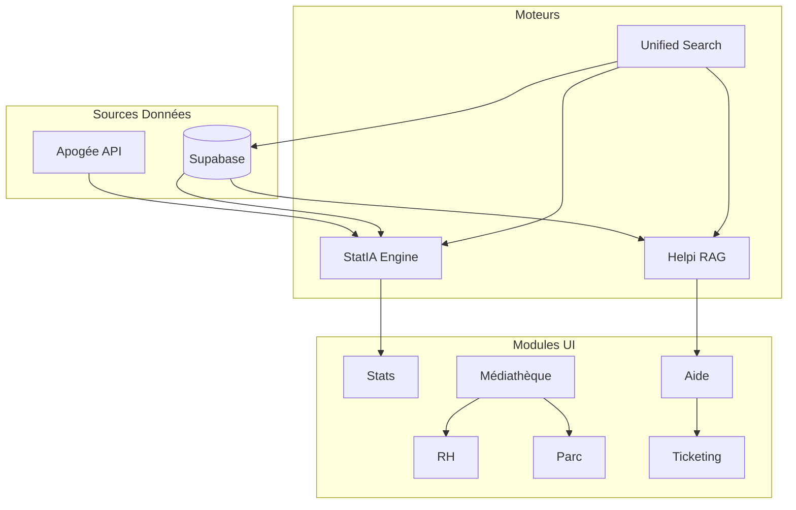

# Documentation Complète des Modules HelpConfort

> **Version**: 1.0  
> **Dernière mise à jour**: 2025-01-31  
> **Auteur**: Équipe Technique HelpConfort

---

## Table des Matières

1. [Architecture Globale](#architecture-globale)
2. [Système de Permissions](#système-de-permissions)
3. [Modules Agence](#modules-agence)
   - [Mon Agence](#mon-agence)
   - [Statistiques (StatIA)](#statistiques-statia)
   - [RH / Salariés](#rh--salariés)
   - [Parc (Véhicules & EPI)](#parc-véhicules--epi)
4. [Modules Divers](#modules-divers)
   - [Apporteurs](#apporteurs)
   - [Plannings](#plannings)
   - [Réunions](#réunions)
   - [Documents (Médiathèque)](#documents-médiathèque)
5. [Modules Support](#modules-support)
   - [Guides (Help! Academy)](#guides-help-academy)
   - [Ticketing (Gestion de Projet)](#ticketing-gestion-de-projet)
   - [Aide (Support & Helpi)](#aide-support--helpi)
6. [Modules Réseau](#modules-réseau)
   - [Réseau Franchiseur](#réseau-franchiseur)
   - [Administration Plateforme](#administration-plateforme)
7. [Module Technicien (PWA)](#module-technicien-pwa)
8. [Recherche Unifiée](#recherche-unifiée)
9. [Inter-connexions Modules](#inter-connexions-modules)
10. [Règles Métier (STATIA_RULES)](#règles-métier-statia_rules)

---

## Architecture Globale

### Stack Technique
- **Frontend**: React 18 + TypeScript + Vite
- **Styling**: Tailwind CSS + shadcn/ui
- **State**: TanStack Query (React Query)
- **Backend**: Supabase (PostgreSQL + Edge Functions)
- **Auth**: Supabase Auth + RLS

### Navigation Unifiée
```
URL: /?tab={module}
Modules: agence | stats | rh | parc | divers_apporteurs | divers_plannings | divers_reunions | divers_documents | guides | ticketing | aide
```

### Fichiers Clés
| Fichier | Description |
|---------|-------------|
| `src/types/modules.ts` | Définition des modules et options |
| `src/permissions/` | Moteur de permissions V1.0 |
| `src/statia/domain/rules.ts` | STATIA_RULES (règles métier CA) |

---

## Système de Permissions

### Hiérarchie des Rôles

| Niveau | Rôle | Description | Accès |
|--------|------|-------------|-------|
| N0 | `base_user` | Utilisateur de base | Guides, Aide |
| N1 | `franchisee_user` | Salarié agence | Pilotage lecture |
| N2 | `franchisee_admin` | Dirigeant agence | Pilotage complet |
| N3 | `franchisor_user` | Animateur réseau | Multi-agences |
| N4 | `franchisor_admin` | Admin réseau | Gestion réseau |
| N5 | `platform_admin` | Admin plateforme | Tout sauf N6 |
| N6 | `superadmin` | Super administrateur | Accès total |

### Logique d'Accès
```typescript
// Ordre de priorité
1. BYPASS: N5+ → accès total
2. PLAN: Modules inclus dans l'abonnement agence
3. OVERRIDES: Surcharges par utilisateur
4. WHITELIST: Modules forcés par admin
```

### Fichiers Permissions
```
src/permissions/
├── index.ts           # Barrel exports
├── types.ts           # Types PermissionContext, etc.
├── constants.ts       # BYPASS_ROLES, MODULE_MIN_ROLES
├── permissionsEngine.ts # hasAccess(), validateUserPermissions()
├── moduleRegistry.ts  # Canon unique modules
└── devValidator.ts    # Validation dev
```

---

## Modules Agence

### Mon Agence

**Clé**: `agence`  
**Rôle minimum**: N2 (`franchisee_admin`)  
**Route**: `/?tab=agence`

#### Fonctionnalités
- **Fiche Agence**: Informations légales, adresse, contacts
- **Profil Commercial**: Logo, baseline, zones intervention
- **Tampons**: Upload des tampons officiels
- **Documents Admin**: Attestations, K-bis, etc.

#### Tables Supabase
```sql
apogee_agencies          -- Données agence
agency_commercial_profile -- Profil marketing
agency_stamps            -- Tampons
agency_admin_documents   -- Documents administratifs
```

#### Composants Clés
```
src/components/agency/
├── AgencyInfoTab.tsx
├── AgencyCommercialTab.tsx
├── AgencyStampsTab.tsx
└── AgencyDocumentsTab.tsx
```

---

### Statistiques (StatIA)

**Clé**: `stats`  
**Rôle minimum**: N2 (`franchisee_admin`)  
**Route**: `/?tab=stats`

#### Présentation
StatIA est le **moteur centralisé de métriques**. Il consomme les données Apogée et applique les règles métier définies dans `STATIA_RULES`.

#### Architecture StatIA
```
src/statia/
├── api/                    # Points d'entrée
│   ├── getMetric.ts
│   └── getMetricForAgency.ts
├── definitions/            # Métriques core
│   ├── ca.ts              # CA global, mensuel, par univers
│   ├── sav.ts             # Taux SAV
│   └── techniciens.ts     # CA par technicien
├── domain/
│   └── rules.ts           # STATIA_RULES (source de vérité)
├── engine/
│   ├── computeStat.ts     # Moteur de calcul
│   └── loaders.ts         # Chargement données Apogée
├── hooks/
│   └── useStatia.ts       # Hooks React Query
└── services/
    └── customMetricsService.ts # Métriques personnalisées
```

#### Métriques Core

| ID | Description | Source |
|----|-------------|--------|
| `ca_global_ht` | CA total HT | apiGetFactures.totalHT |
| `ca_mensuel` | CA par mois | factures groupées |
| `ca_par_univers` | CA ventilé univers | project.universes |
| `ca_par_apporteur` | CA par commanditaire | project.commanditaireId |
| `ca_par_technicien` | CA attribué technicien | interventions.userId |
| `taux_sav_global` | % SAV | dossiers SAV / total |
| `taux_transformation_devis` | Devis → Facture | count + montant |

#### Règles STATIA_RULES (Extrait)
```typescript
// src/statia/domain/rules.ts
export const STATIA_RULES = {
  ca: {
    source: 'apiGetFactures.data.totalHT',
    states: ['sent', 'paid', 'partially_paid', 'overdue'],
    avoirs: { treatment: 'subtract' }
  },
  technicians: {
    productiveTypes: ['depannage', 'travaux', 'recherche de fuite'],
    nonProductiveTypes: ['RT', 'TH', 'SAV', 'diagnostic'],
    RT_generates_NO_CA: true
  },
  sav: {
    identification: 'linked_dossier',
    caImpact: 0,
    excludeFromTechStats: true
  }
};
```

#### Edge Function
```typescript
// supabase/functions/compute-metric/index.ts
// Calcule les métriques côté serveur pour performances
```

---

### RH / Salariés

**Clé**: `rh`  
**Rôle minimum**: N0 (coffre), N2 (admin)  
**Route**: `/?tab=rh`

#### Fonctionnalités

| Sous-module | Rôle | Description |
|-------------|------|-------------|
| Coffre-fort | N1 | Consultation documents personnels |
| Équipe | N2 | Vue équipe sans données sensibles |
| Admin RH | N2 | Gestion complète + paie |

#### Tables Supabase
```sql
collaborators            -- Données collaborateurs
collaborator_sensitive_data -- Données chiffrées (paie)
collaborator_documents   -- Documents RH
collaborator_skills      -- Compétences
collaborator_certifications -- Certifications
collaborator_absences    -- Absences
collaborator_contracts   -- Contrats
```

#### Sécurité
- **Chiffrement**: Données sensibles via `vault.secrets`
- **RLS**: Accès strictement limité par agence
- **Audit**: Logs d'accès aux données sensibles

#### Génération Documents
```typescript
// Edge Function: generate-hr-document
// Génère: bulletins, attestations, contrats
// Format: PDF via jsPDF
```

---

### Parc (Véhicules & EPI)

**Clé**: `parc`  
**Rôle minimum**: N1 (`franchisee_user`)  
**Route**: `/?tab=parc`

#### Sous-modules

**Flotte Véhicules**
- Liste véhicules (immatriculation, kilométrage)
- Échéances (CT, assurance, entretiens)
- Affectation techniciens
- Alertes automatiques

**EPI (Équipements Protection)**
- Stock EPI par type
- Affectation individuelle
- Signature numérique remise
- QR codes tracking

#### Tables Supabase
```sql
fleet_vehicles           -- Véhicules
fleet_assignments        -- Affectations
maintenance_events       -- Événements maintenance
epi_stock               -- Stock EPI
epi_assignments         -- Affectations EPI
epi_signatures          -- Signatures remise
```

#### Alertes CRON
```typescript
// Edge Function: check-fleet-alerts
// Déclenché: quotidien
// Alerte: CT < 30j, assurance < 30j, entretien dépassé
```

---

## Modules Divers

### Apporteurs

**Clé**: `divers_apporteurs`  
**Rôle minimum**: N2 (`franchisee_admin`)  
**Route**: `/?tab=divers_apporteurs`

#### Fonctionnalités
- **CRM Apporteurs**: Gestion commanditaires (assurances, bailleurs)
- **Portail Externe**: Accès apporteurs pour suivi dossiers
- **Demandes Intervention**: Saisie demandes par apporteurs

#### Tables Supabase
```sql
apporteurs              -- Apporteurs (nom, type, logo)
apporteur_contacts      -- Contacts apporteur
apporteur_users         -- Utilisateurs portail
apporteur_sessions      -- Sessions JWT
apporteur_otp_codes     -- Codes OTP connexion
apporteur_intervention_requests -- Demandes
apporteur_project_links -- Liens projet Apogée
```

#### Authentification Portail
```typescript
// Authentification par OTP (email)
// 1. Apporteur saisit email
// 2. OTP envoyé
// 3. Validation → JWT session
// 4. Accès portail limité
```

#### Composants
```
src/components/apporteurs/
├── ApporteursPage.tsx        # Vue principale
├── ApporteurForm.tsx         # Création/édition
├── ApporteurPortalSettings.tsx
└── portal/
    ├── ApporteurLogin.tsx
    └── ApporteurDashboard.tsx
```

---

### Plannings

**Clé**: `divers_plannings`  
**Rôle minimum**: N2 (`franchisee_admin`)  
**Route**: `/?tab=divers_plannings`

#### Fonctionnalités
- Visualisation planning techniciens
- Synchronisation Apogée
- Export iCal

#### Intégration Apogée
```typescript
// Données depuis: apiGetInterventions
// Affichage: calendrier semaine/mois
// Techniciens: apiGetUsers
```

---

### Réunions

**Clé**: `divers_reunions`  
**Rôle minimum**: N2 (`franchisee_admin`)  
**Route**: `/?tab=divers_reunions`

#### Fonctionnalités
- Création réunions agence
- Ordre du jour
- Compte-rendu
- Participants
- Documents associés (via Médiathèque)

#### Tables Supabase
```sql
agency_meetings         -- Réunions
meeting_participants    -- Participants
meeting_agenda_items    -- Points ODJ
meeting_decisions       -- Décisions
```

---

### Documents (Médiathèque)

**Clé**: `divers_documents`  
**Rôle minimum**: N2 (`franchisee_admin`)  
**Route**: `/?tab=divers_documents`

#### Modèle Asset-Link
```
Asset (fichier physique)
  └── Links (références contextuelles)
       ├── /rh/salaries/{id}
       ├── /reunions/{id}
       └── /agence/documents
```

#### Tables Supabase
```sql
media_assets           -- Fichiers physiques
media_links            -- Références contextuelles
media_folders          -- Dossiers virtuels
media_tags             -- Tags classification
```

#### Fonctionnalités
- **Drag & Drop**: Upload multiple
- **Quick Look**: Prévisualisation (Espace)
- **Dossiers**: Organisation hiérarchique
- **Tags**: Classification transverse
- **Recherche**: Fulltext sur métadonnées

#### Composants
```
src/components/media-library/
├── MediaLibraryPage.tsx
├── MediaGrid.tsx
├── MediaQuickLook.tsx
├── MediaUploader.tsx
├── MediaFolderTree.tsx
└── hooks/
    ├── useMediaAssets.ts
    └── useMediaUpload.ts
```

---

## Modules Support

### Guides (Help! Academy)

**Clé**: `guides` / `help_academy`  
**Rôle minimum**: N0 (`base_user`)  
**Route**: `/?tab=guides`

#### Sections
| Section | Contenu |
|---------|---------|
| Apogée | Tutoriels logiciel métier |
| Apporteurs | Relations commanditaires |
| HelpConfort | Processus réseau |

#### Tables Supabase
```sql
apogee_guides          -- Guides/tutoriels
-- Champs: categorie, section, titre, texte, tags
```

#### Fonctionnalités
- Navigation par catégorie/section
- Recherche fulltext
- Favoris utilisateur
- Historique consultation

---

### Ticketing (Gestion de Projet)

**Clé**: `ticketing` / `apogee_tickets`  
**Rôle minimum**: N0 (`base_user`)  
**Route**: `/?tab=ticketing`

#### Présentation
Système de gestion de projet interne pour le suivi des évolutions Apogée, bugs, et demandes.

#### Tables Supabase
```sql
apogee_tickets           -- Tickets
apogee_ticket_statuses   -- Statuts kanban
apogee_ticket_comments   -- Commentaires
apogee_ticket_attachments-- Pièces jointes
apogee_ticket_history    -- Historique
apogee_ticket_tags       -- Tags
apogee_modules           -- Modules Apogée
apogee_priorities        -- Priorités
apogee_ticket_transitions-- Transitions autorisées
apogee_ticket_user_roles -- Rôles spécifiques
```

#### Workflow Kanban
```
Nouveau → Qualifié → En cours → Review → Terminé
                  ↘ Bloqué ↗
```

#### Champs Ticket
| Champ | Description |
|-------|-------------|
| `element_concerne` | Titre/sujet |
| `description` | Description détaillée |
| `module` | Module Apogée concerné |
| `kanban_status` | Statut workflow |
| `heat_priority` | Score priorité (0-100) |
| `h_min` / `h_max` | Estimation heures |
| `is_qualified` | Ticket qualifié |
| `roadmap_enabled` | Affiché roadmap |

#### Composants
```
src/components/tickets/
├── TicketKanban.tsx
├── TicketCard.tsx
├── TicketDetail.tsx
├── TicketForm.tsx
└── filters/
    └── TicketFilters.tsx
```

---

### Aide (Support & Helpi)

**Clé**: `aide` / `support`  
**Rôle minimum**: N0 (`base_user`)  
**Route**: `/?tab=aide`

#### Fonctionnalités

**Chatbot Helpi (RAG)**
- Recherche sémantique dans documentation
- Réponses contextualisées
- Escalade vers ticket si non résolu

**Tickets Support**
- Création demande support
- Suivi statut
- Communication bidirectionnelle

#### Architecture RAG
```typescript
// 1. Indexation
helpi_documents → chunking → embeddings → helpi_chunks

// 2. Requête
question → embedding → similarity_search → contexte → LLM → réponse
```

#### Tables Supabase
```sql
helpi_documents         -- Documents sources
helpi_chunks            -- Chunks vectorisés
helpi_conversations     -- Conversations utilisateur
helpi_messages          -- Messages conversation
support_tickets         -- Tickets support
support_ticket_messages -- Messages ticket
```

#### Edge Functions
```
supabase/functions/
├── helpi-chat/           # Chat RAG
├── helpi-index/          # Indexation documents
└── support-ticket-notify/ # Notifications
```

---

## Modules Réseau

### Réseau Franchiseur

**Clé**: `reseau_franchiseur`  
**Rôle minimum**: N3 (`franchisor_user`)  
**Route**: `/reseau/*`

#### Fonctionnalités

**Dashboard Multi-Agences**
- Vue consolidée toutes agences
- KPIs réseau agrégés
- Comparatifs inter-agences

**Browser Tabs**
```typescript
// Système d'onglets navigateur interne
// Permet d'ouvrir plusieurs vues agence simultanément
interface NetworkTab {
  id: string;
  type: 'agency' | 'dashboard' | 'report';
  agencySlug?: string;
  title: string;
}
```

**Redevances**
```typescript
// Calcul redevances par tranches
interface RoyaltyConfig {
  tiers: {
    from: number;
    to: number | null;
    percentage: number;
  }[];
}
```

**Visites Animateur**
```sql
animator_visits         -- Visites terrain
-- Champs: agency_id, animator_id, visit_date, visit_type, report_content
```

#### Tables Spécifiques
```sql
agency_royalty_config      -- Configuration redevances
agency_royalty_tiers       -- Tranches
agency_royalty_calculations -- Calculs mensuels
animator_visits            -- Visites animateurs
```

---

### Administration Plateforme

**Clé**: `admin_plateforme`  
**Rôle minimum**: N5 (`platform_admin`)  
**Route**: `/admin/*`

#### Fonctionnalités

**Gestion Utilisateurs**
- CRUD utilisateurs toutes agences
- Attribution rôles
- Activation/désactivation

**Feature Flags**
```sql
feature_flags           -- Flags fonctionnalités
-- Champs: key, is_enabled, rollout_percentage, target_roles
```

**Configuration Modules**
```sql
plan_tiers              -- Plans abonnement
agency_subscription     -- Abonnements agences
agency_module_overrides -- Surcharges modules
```

**Monitoring**
- Logs système
- Métriques performances
- Alertes erreurs (Sentry)

---

## Module Technicien (PWA)

**Clé**: Module dédié PWA  
**Route**: `/technicien/*` ou app mobile

#### Présentation
Application Progressive Web App pour les techniciens terrain. Fonctionne offline via IndexedDB.

#### Fonctionnalités

**Relevé Technique (RT)**
```typescript
// Système d'arbre de questions
interface RTSession {
  id: string;
  projectId: number;
  technicianId: string;
  status: 'in_progress' | 'completed' | 'synced';
  answers: Record<string, QuestionAnswer>;
  photos: RTPhoto[];
  signature?: string;
}
```

**Arbre de Questions**
```typescript
interface QuestionNode {
  id: string;
  type: 'text' | 'number' | 'select' | 'photo' | 'signature';
  question: string;
  required: boolean;
  next?: string | ((answer: any) => string);
  validation?: (answer: any) => boolean;
}
```

**Mode Offline**
```typescript
// Stockage local via Dexie (IndexedDB)
// Sync automatique au retour online
```

#### Tables Supabase
```sql
rt_sessions             -- Sessions RT
rt_answers              -- Réponses
rt_photos               -- Photos
rt_templates            -- Templates questions
```

---

## Recherche Unifiée

**Clé**: `unified_search`  
**Rôle minimum**: N1 (`franchisee_user`)

#### Présentation
Barre de recherche globale avec routage intelligent vers les différents moteurs.

#### Architecture
```typescript
// Tokenisation et classification
const query = "CA technicien Martin janvier";
const tokens = tokenize(query);
// → { metric: 'ca', dimension: 'technicien', filter: 'Martin', period: 'janvier' }

// Routage
if (isStatiaQuery(tokens)) → StatIA
if (isHelpQuery(tokens)) → RAG Helpi
if (isEntityQuery(tokens)) → DB Search
```

#### Composants
```
src/components/search/
├── UnifiedSearchBar.tsx
├── SearchResults.tsx
├── QueryClassifier.ts
└── SearchRouter.ts
```

---

## Inter-connexions Modules



---

## Règles Métier (STATIA_RULES)

### Source de Vérité
```
src/statia/domain/rules.ts
```

### Structure Complète
```typescript
export const STATIA_RULES = {
  // ===== CA (Chiffre d'Affaires) =====
  ca: {
    source: 'apiGetFactures.data.totalHT',
    states: {
      included: ['draft', 'sent', 'paid', 'partially_paid', 'overdue'],
      excluded: []
    },
    avoirs: {
      treatment: 'subtract',
      asNegative: true
    },
    dueClient: 'apiGetFactures.data.calcReglementsReste',
    dateField: {
      priority: 'dateReelle',
      fallback: 'date'
    }
  },

  // ===== Techniciens =====
  technicians: {
    productiveTypes: ['depannage', 'travaux', 'recherche de fuite'],
    nonProductiveTypes: ['RT', 'TH', 'SAV', 'diagnostic'],
    RT_generates_NO_CA: true,
    attribution: {
      method: 'proportional_time',
      source: 'getInterventionsCreneaux'
    },
    type2Resolution: {
      field: 'type2',
      unknownValue: 'A DEFINIR',
      checkOrder: ['biDepan.Items.IsValidated', 'biTvx.Items.IsValidated', 'biRt.Items.IsValidated']
    }
  },

  // ===== SAV =====
  sav: {
    identification: 'linked_dossier',
    caImpact: 0,
    excludeFromTechStats: true,
    costCalculation: {
      factors: ['time_spent', 'visit_count', 'parent_invoice_percentage']
    }
  },

  // ===== Devis =====
  devis: {
    validatedStates: ['validated', 'signed', 'order', 'accepted'],
    autoValidated: {
      condition: 'has_linked_invoice'
    },
    transformationRate: {
      byCount: 'count(invoiced) / count(emitted)',
      byAmount: 'sum(invoiced_HT) / sum(quoted_HT)'
    }
  },

  // ===== Interventions =====
  interventions: {
    validStates: ['validated', 'done', 'finished'],
    excludedStates: ['draft', 'canceled', 'refused'],
    accountingStatus: {
      source: 'apiGetProjects.state',
      never: 'intervention.state'
    }
  },

  // ===== Classification =====
  classification: {
    apporteur: {
      source: 'project.data.commanditaireId',
      default: 'Direct'
    },
    univers: {
      source: 'project.data.universes',
      multiUnivers: 'prorata_lignes',
      default: 'Non classé'
    },
    techniciens: {
      primary: 'intervention.userId',
      additional: 'visites[].usersIds'
    }
  },

  // ===== Agrégations =====
  aggregations: ['sum', 'count', 'avg', 'min', 'max', 'median', 'ratio'],
  
  groupBy: [
    'technicien', 'apporteur', 'univers',
    'type_intervention', 'type_devis',
    'mois', 'semaine', 'année',
    'ville', 'client', 'dossier'
  ],

  // ===== Synonymes NLP =====
  synonyms: {
    apporteur: ['commanditaire', 'prescripteur'],
    univers: ['metier', 'domaine'],
    rt: ['releve technique', 'rdv technique'],
    sav: ['service apres vente', 'garantie', 'retour chantier'],
    travaux: ['tvx', 'work', 'reparation'],
    technicien: ['intervenant', 'ouvrier']
  },

  // ===== Cas Extrêmes =====
  edgeCases: {
    projectWithoutUnivers: 'Non classé',
    projectWithoutApporteur: 'Direct',
    interventionWithoutVisit: 'use intervention.userId',
    invoiceWithoutInterventions: 'attribute 100% to agency',
    cancelledIntervention: 'ignore',
    abandonedProject: 'CA = 0'
  }
};
```

---

## Annexes

### A. Mapping Endpoints Apogée

| Endpoint | Données |
|----------|---------|
| `apiGetProjects` | Dossiers/projets |
| `apiGetInterventions` | Interventions/RDV |
| `apiGetDevis` | Devis |
| `apiGetFactures` | Factures |
| `apiGetClients` | Clients/Apporteurs |
| `apiGetUsers` | Utilisateurs/Techniciens |

### B. Variables d'Environnement

```env
VITE_SUPABASE_URL=
VITE_SUPABASE_PUBLISHABLE_KEY=
VITE_APOGEE_API_URL=
```

### C. Conventions de Nommage

| Type | Convention | Exemple |
|------|------------|---------|
| Composant | PascalCase | `MediaQuickLook.tsx` |
| Hook | camelCase + use | `useMediaAssets.ts` |
| Type | PascalCase | `PermissionContext` |
| Table SQL | snake_case | `media_assets` |
| Module Key | snake_case | `pilotage_agence` |

---

*Documentation générée et maintenue par l'équipe technique HelpConfort.*
